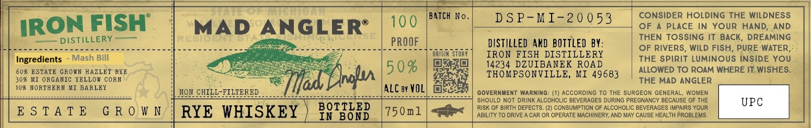

# TTB COLA Label Images - TTBID 26077001000512

**Brand Name:** IRON FISH DISTILLERY

**Issue Date:** 03/20/2026

**Origin Code:** 06

**Product Class/Type:** 112

**Source:** [TTB Public COLA Registry](https://ttbonline.gov/colasonline/viewColaDetails.do?action=publicFormDisplay&ttbid=26077001000512)

## Label Images

### Label 1

## Extracted Label Text

*Text extracted via OCR - may contain errors*

### Label 1

BATcH No_
DS P-MI-20 053
CONSIDER HOLDING THE WILDNESS
IRON FISH
MAD ANGLERE
100
OF
PLACE in Your HanD; AND
DISTILLERY
THEN TOSSING IT BACK
DREAMING
PROOF
diStILLeD AnD  BOTTLED BY:
OF RIVERS, WILD FISH; PURE WATER=
Ingredients
Mash Bill
STORY
IRon FISH DISTILLERY
THE SpiRIT LUMINOUS INSIDE YOU
604
ESTATE CROwN HAZLET RYE
5 0 %
14234 DZUIBANEK ROAD
ALLOWED TO ROAM WHERE IT WISHES_
30% KI ORCANIC YELLOW
CORN
dnlm
THOMPSONVILLE, MI 49683
THE MAD ANGLER
10% NORTHERN MI BARLEY
NoN CHILL-TILTEREP
Tlat
ALC by VOL
GOVERNMENT WARNING-
ACCORDING To THE SURGEON GENERAL,
WOMEN
SHOULD NOT DRINK ALCOHOLIC BEVERAGES DURING PREGNANCY BECAUSE OF THE
UPC
E $ T A T E
G R 0 W N
RYE WHISKEY
BOTTLED
750m1
RISK OF BIRTH DEFECTS
(2) CONSUMPTION OF ALCOHOLIC BEVERACES IMPAIRS YOUR
IN BOND
ABILITY TO DRIVE A CAR OR OPERATE MACHINERY; AND MAY CAUSE HEALTH PROBLEMS
