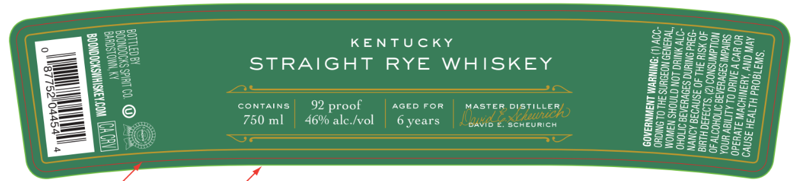
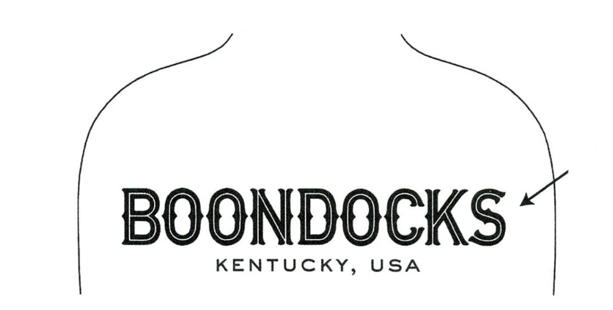
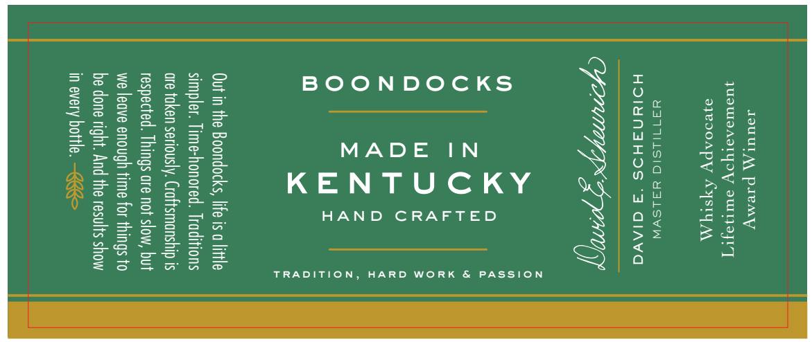
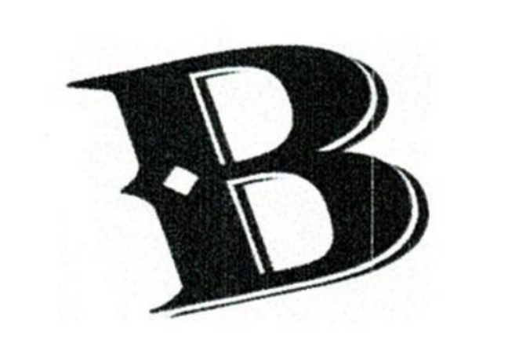

# TTB COLA Label Images - TTBID 26077001000558

**Brand Name:** BOONDOCKS

**Fanciful Name:** KENTUCKY STRAIGHT RYE WHISKEY

**Issue Date:** 03/18/2026

**Origin Code:** 22

**Product Class/Type:** 102

**Source:** [TTB Public COLA Registry](https://ttbonline.gov/colasonline/viewColaDetails.do?action=publicFormDisplay&ttbid=26077001000558)

## Label Images

### Front Label

### Label 1

### Label 3

### Label 4

## Extracted Label Text

*Text extracted via OCR - may contain errors*

*2 image(s) excluded: text did not meet readability threshold*

**Detected Proof:** 92
**Detected Age:** 6 Years

### Front Label

es

=

2

=}

Zoe

Ses

Sees

eASios

3S

KENTUCKY

=S=2

se

——

a=

SeEeo

Ssecs

=S

=|

oe

=

=a

est

Sse

==

a

STRAIGHT RYE WHISKEY

25

g=

Sees

Q=2=a

p< —

25s

22-

ESSse

Sseesa

=

§22°os

=ES

a

2

Ee

esucges

2&

Se

N=

esezx

s=

o==

Ss

CONTAINS

92 proof

AGED FOR

MASTER, DISTILLER,

EwSss

=SG2

s>

=

1

bet 4O

=e

SoS

Slag

Sess

Sz

e

750 ml

46% alc./vol

6 years

/ ddVio €. ScheuRICH

=e

ERS

=

Boss

aoe

=

@

€

2

s2

Bs =

S2EzS

S23

cen

su

=

Se

Ss

S22

ss

E=S&S

Bs

35

ss

### Label 3

JUL, Preay
JUSUTDASIYOYW OUI]

ayeooapy AYsIy

YaTIILSIG YaLsvW
HOIYNAHOS “3 AlIAva

SOY PZ RING

IN

HARD WORK & PASSION

>
4
O
i)
OF
<
sZ
LJ
4

fa)
Wl
F
Lo
<
ind
10}
a
z
<
x

BOONDOCKS

TRADITION,

Out in the Boondocks, life is a little
simpler. Time-honored. Traditions
are taken seriously. Craftsmanship is
respected. Things are not slow, but
we leave enough time for things to
be done right. And the results show

in every bottle. <g>
