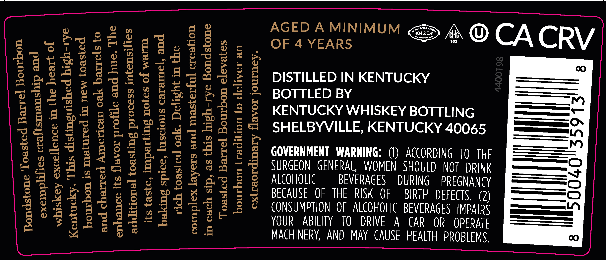
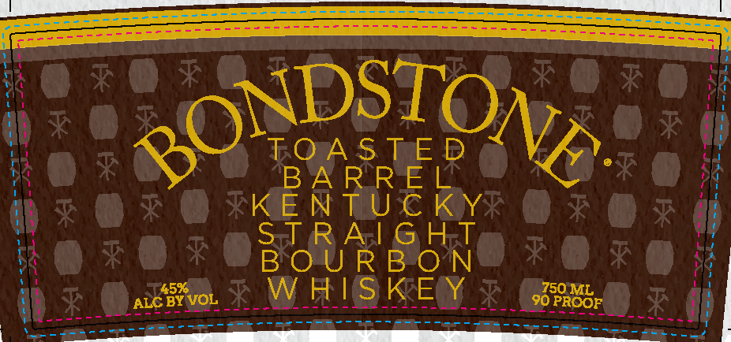

# TTB COLA Label Images - TTBID 26077001000577

**Brand Name:** BONDSTONE

**Issue Date:** 03/18/2026

**Origin Code:** 22

**Product Class/Type:** 101

**Source:** [TTB Public COLA Registry](https://ttbonline.gov/colasonline/viewColaDetails.do?action=publicFormDisplay&ttbid=26077001000577)

## Label Images

### Back Label

### Front Label

## Extracted Label Text

*Text extracted via OCR - may contain errors*

### Back Label

(— cecedt.g £4. ASEDAMNIMUM > @ CACRV)
Bq
; eerie CLPa ere =—
SEEBLESEP GER ESSE DISTILLED IN KENTUCKY ——n
gg522 2225 bssae2: BOTTLED BY ————~
ro) onl oS =
Soe ba Eg £eEee ges KENTUCKY WHISKEY BOTTLING ———
Re PEE segs Seat ass NTUCKY 40065 =——
Pie eiseseee 28 8 SHELBYVILLE, KE ———_™
aw as i424 9 ————
eee BBS ERPS LE Dm BP : (1) ACCORDING TO THE ———=0O
BE hese REELS 25 Es 2 coveewnen RAL, WOMEN SHOULD NOT DRINE —_—+
Bret EEsa as $2 84 E = suRccon GENERAL DURING PREGNANCY [ico <=
sige ceseisiual¢ BECAUSE. OF THE RK OF ER ee =
PELE eee eree SECUSE OFTHE RM OF RTH DEC —
ee Ses et es Pet laee CONSUMPTION OF ALCOHOL eS PERE —————
SeBses ees esa ss YOUR ABILITY 10 DRIV Ma 00
Pe: a3 : Ee =a ge MACHINERY, AND MAY CAUSE HEALTH PR
aa Vv, 7)

### Front Label

LL
ki ON oes nee Ne. i
ne BARREL mf
7 KIE N THU Riy rT
Ht Sol da Ac! mm Hel uy
be BOURBON i
Ay are kB RISE Eee HIE
