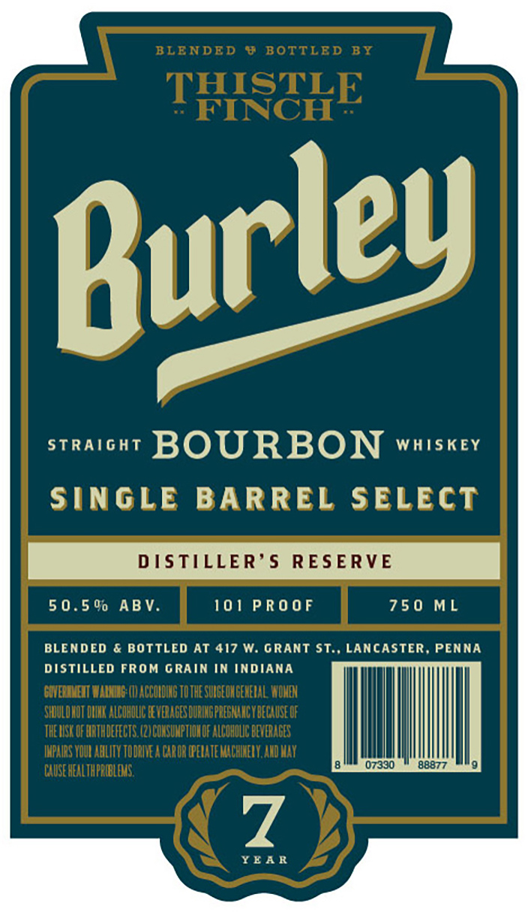
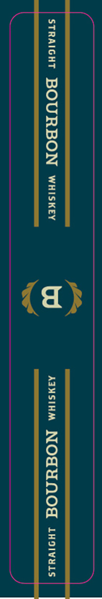

# TTB COLA Label Images - TTBID 26077001000581

**Brand Name:** BURLEY BOURBON

**Issue Date:** 03/18/2026

**Origin Code:** 39

**Product Class/Type:** 101

**Source:** [TTB Public COLA Registry](https://ttbonline.gov/colasonline/viewColaDetails.do?action=publicFormDisplay&ttbid=26077001000581)

## Label Images

### Label 1

### Label 2

## Extracted Label Text

*Text extracted via OCR - may contain errors*

### Label 1

BLENDED
8 BOTTLED BY
THISTLE
FINCH
Straight
BOURBON
WhISKEY
SingLe BARREL SelecT
DSTILLER'$
RESERVE
5 0. 5 00 ABV.
101 PRO 0 F
75 0 ML
BLENDED
{ BOTTLED AT 417 W: GraNT St:, LANCASTER, PENNA
DISTILLED FROM GRAIN IN INDIANA
GUEQIMEIT MALMMG (IV ACCOLDING TOTHE SUIGEOHGEMETAL WOHE
SHULDHOT DIHK ALCOHOLIC [EVEAGES DURINOPREBMHAC Y DECAUSE OF
THEIISK OF HRTHDEFECTS (2I COHSUHPTHOHOF ALCOHOUC DEVERAOES
IMPAIRS YOUI ABLIIY TODRILEA CAROR OPEIATE MACHIHELY.AHd VaY
07330
88877
CXUSE HEALTHPRMBLES,
7
YEA R
Burley

### Label 2

STRAIGHT BOURBON wiiskey AMSIEM NOGUNO tuvoivas
