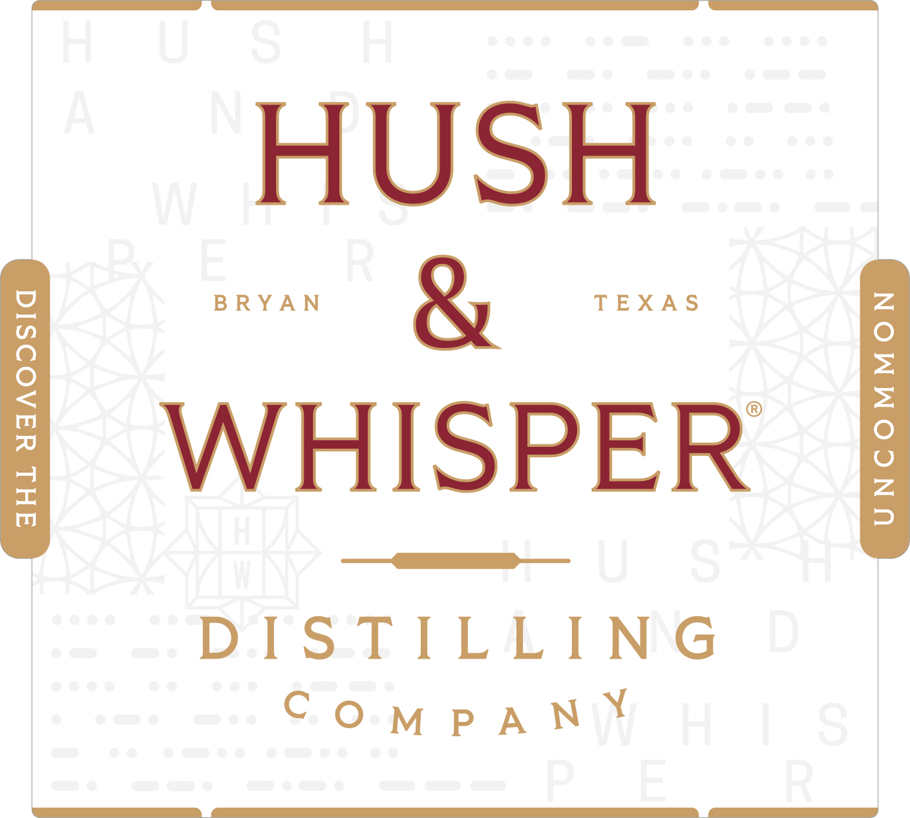
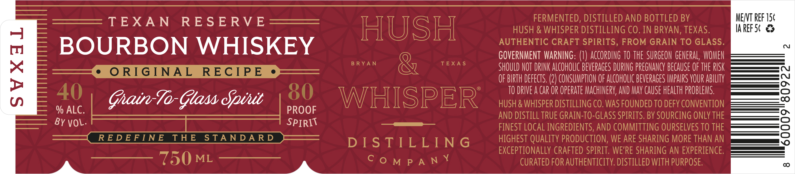

# TTB COLA Label Images - TTBID 26077001000583

**Brand Name:** HUSH & WHISPER

**Issue Date:** 03/18/2026

**Origin Code:** 44

**Product Class/Type:** 141

**Source:** [TTB Public COLA Registry](https://ttbonline.gov/colasonline/viewColaDetails.do?action=publicFormDisplay&ttbid=26077001000583)

## Label Images

### Label 1

### Label 2

## Extracted Label Text

*Text extracted via OCR - may contain errors*

*1 image(s) excluded: text did not meet readability threshold*

### Label 2

FERMENTED, DISTILLED AND BOTTLED BY

ME/VT REF 15¢

TEXAN RESERVE

HUSH & WHISPER DISTILLING CO. IN BRYAN, TEXAS.

IAREF 5¢ &%

AlU Sil

AUTHENTIC CRAFT SPIRITS, FROM GRAIN TO GLASS.

BOURBON WHISKEY

GOVERNMENT WARNING:

ACCORDING 10 THE SURGEON GENERAL, WOME

SHOULD NOT DRINK ALCOHOLIC BEVERAGES DURING PREGNANCY BECAUSE OF THE RISK

OF BIRTH DEFECTS. (2) CONS

TION OF ALCOHOLIC BEVERAGES IMPAIRS YOUR ABILITY

10

qD

rf ) ()

l

)

TO DRIVE A CAR OR OPERATE MACHINERY, AND MAY CAUSE HEALTH PROBLEMS.

Grain Ta Glass Sott

WHISPER

HUSH & WHISPER DISTILL

G CO. WAS FOUNDED TO DEFY CONVENTIO.

% ALC.

PROOF

AND DISTILL TRUE GRAIN-TO-GLASS SPIRITS. BY SOURCING ONLY THE

BY VOL-

SPIRV

FINEST LOCAL INGREDIENTS, AND COM

TTING OURSELVES T0 THE

DISTILLING

HIGHEST QUALITY PRODUCTION, WE ARE SHARING MORE THAN A

EXCEPTIONALLY CRAFTED SPIRIT. WE'RE SHARING AN EXPERIENCE.

NO wT NPT SON’

COmpaN *

CURATED FOR AUTHENTICITY. DISTILLED WITH PURPOSE.
