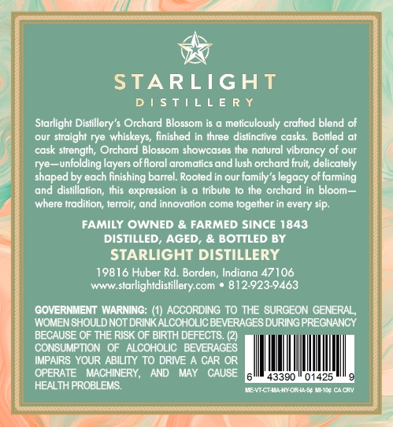
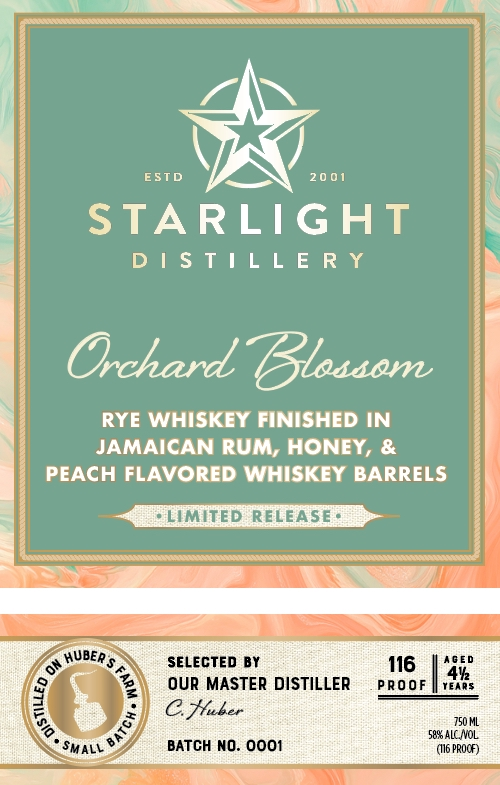

# TTB COLA Label Images - TTBID 26077001000639

**Brand Name:** STARLIGHT DISTILLERY

**Fanciful Name:** ORCHARD BLOSSOM

**Issue Date:** 03/25/2026

**Origin Code:** 19

**Product Class/Type:** 142

**Source:** [TTB Public COLA Registry](https://ttbonline.gov/colasonline/viewColaDetails.do?action=publicFormDisplay&ttbid=26077001000639)

## Label Images

### Back Label

### Front Label

## Extracted Label Text

*Text extracted via OCR - may contain errors*

### Back Label

STARLIGHT
D | $t| L L E RY
Starlight Distillery'$ Orchard Blossom is
meliculously crafted blend of
our straight rye whiskeys; finished in three dislinctive casks:
Boliled at
cask strengih; Orchard Blossom showcases the natural vibrancy of our
rye
unfolding layers offloral aromalics and lush orchard fruit; delicately
shaped by each finishing barrel  Rooted in our family's legacy offarming
dmd
disiillation; Ihis expression
Irbule i0 Ihe orchard in bloom =
where Iradilion; teloin dnd innovation come
together in every sip.
FAMILY OWNED & FARMED SINCE 1843
DISTILLED;
AGED;
& BOTTLED BY
STARLIGHT DISTILLERY
19816 Huber Rd. Borden, Indiana 47106
WwW
starlightdistillery com
812-923-9463
GoveRNMENT WARNING:
ACCORDING TO THE SURGEON GENERAL ,
WOMENSHOULD NOT DRINK ALCOHOLIC BEVERAGES DURINGPREGNANCY
BECAUSE OF THE RISK OF BIRTH DEFECTS
CONSUMPTION
ALCOHOLIC
BEVERAGES
IMPAIRS YOUR: ABILITY T0 DRIE
CAR OR
OPERATE
MACHINERY,
AND
MAY
CGAUSE
43390
01425
HEALTH PROBLEMS
enEnaeeete
Cace

### Front Label

NO Ee

ZT)

)

ESTD 2001

STARLIGHT

DISTILLERY

RYE WHISKEY FINISHED IN
JAMAICAN RUM, HONEY, &
PEACH FLAVORED WHISKEY BARRELS

* LIMITED RELEASE*

SELECTED BY 16 | Ase

OUR MASTER DISTILLER pRooF ae,
CHhaber

seat
BATCH NO. 0001 ‘(6 PROOF)
