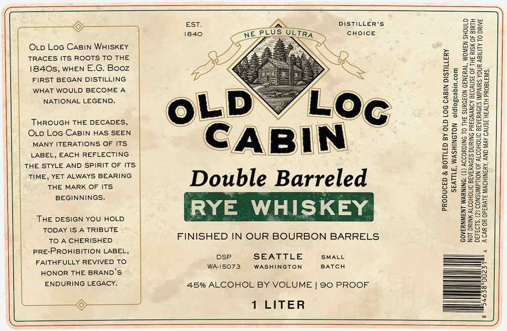

# TTB COLA Label Images - TTBID 26077001000706

**Brand Name:** OLD LOG CABIN

**Issue Date:** 03/18/2026

**Origin Code:** 07

**Product Class/Type:** 142

**Source:** [TTB Public COLA Registry](https://ttbonline.gov/colasonline/viewColaDetails.do?action=publicFormDisplay&ttbid=26077001000706)

## Label Images

### Label 1

## Extracted Label Text

*Text extracted via OCR - may contain errors*

**Detected Proof:** 90

### Label 1

Otp Loc Casin WHISKEY
TRACES ITS ROOTS TO THE
1840s, WHEN E.G. Booz
FIRST BEGAN DISTILLING
WHAT WOULD BECOME A
NATIONAL LEGEND.

THROUGH THE DECADES,
Oxp Loc CaBiN HAS SEEN
MANY ITERATIONS OF ITS
LABEL, EACH REFLECTING
THE STYLE AND SPIRIT OF ITS
TIME, YET ALWAYS BEARING
THE MARK OF ITS
BEGINNINGS.

THE DESIGN YOU HOLD
TODAY IS A TRIBUTE
TO A CHERISHED
PRE-PROHIBITION LABEL,
FAITHFULLY REVIVED TO
HONOR THE BRAND'S:
ENDURING LEGACY.

Se

DISTILLER'S

Double Barreled

YE WHISKEY

FINISHED IN OUR BOURBON BARRELS

DSP SEATTLE SMALL
WAIS5073 WASHINGTON — BATCH

45% ALCOHOL BY VOLUME | 90 PROOF
1 LITER

z=
2
a
=
S
&
3
A]
a
3
=
&
8
=
S
a
cy
a
s
a
2

§
5
=
5
iS
5
2
a
8
=
E
a
oe

=
2
.

‘THE SURGEON GENERAL, WOMEN SHOULD

>REGNANCY BECAUSE OF THE RISK OF BIRTH
EVERAGES IMPAIRS YOUR ABILITY TO DRIVE

ACAR OR OPERATE MACHINERY, AND MAY CAUSE HEALTH PROBLEMS.

NOT DRINK ALCOHOLIC BEVERAGES DURING Ps
DEFECTS. (2) CONSUMPTION OF ALCOHOLIC Bt
