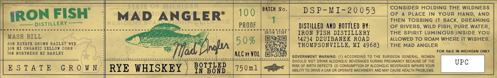

# TTB COLA Label Images - TTBID 26077001000720

**Brand Name:** IRON FISH DISTILLERY

**Issue Date:** 03/19/2026

**Origin Code:** 06

**Product Class/Type:** 142

**Source:** [TTB Public COLA Registry](https://ttbonline.gov/colasonline/viewColaDetails.do?action=publicFormDisplay&ttbid=26077001000720)

## Label Images

### Label 1

## Extracted Label Text

*Text extracted via OCR - may contain errors*

**Detected Proof:** 60

### Label 1

BaTcH No
DS P-MI-2 0 0 53
CONSIDER HOLDING THE WILDNESS
IRON FISH
MAD ANGLERE
100
OF
A PLACE
IN YOUR
HAND;
AND
THEN TOSSING IT: BACK
DREAMING
DISTILLERY
0C` DE
PROOF
DISTILLED AnD BOTTLED BY:
OF RIVERS
WILd FiSh; PURE WATER;
IRON FISH DISTILLERY
THE Spirit LuminoUs INSIDE YoU
MASH BILL
5 0 %
14234 DZUIBANEK ROAD
ALLOWED TO ROAM WHERE IT WISHES
60% ESTATE GRown HAZLET RYE
Dlm
THOMPSONVILLE, KI 49683
THE MAD ANGLER
30%
ORGANIC YELLOW CoRN
Tat
FOR SALE IN MICHIGAN ONLY
10% NORTHERN
MI BARLEY
ALC By VOL]
GOVERNMENT
WARNING
(1) ACCORDING
To THE SURGEON
GENERAL,
WOMEN
SHOULD NOT DRINK ALCOHOLIC BEVERAGES DURING PREGNANCY BECAUSE OF THE
UPC
E $ T A T E
G R 0 W N
RYE WHISKEY
PPTGER
75 0m
RISK OF BIRTH DEFECTS: (2) CONSUMPTION OF ALCOHOLIC BEVERAGES IMPAIRS YOUR
In
ABILITY TO DRIVE
CAR OR OPERATE MACHINERY; AND MAY CAUSE HEALTH PROBLEMS
