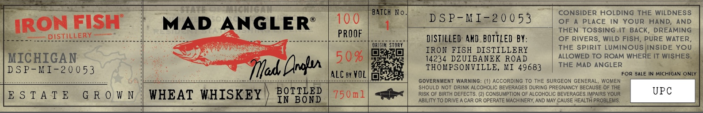

# TTB COLA Label Images - TTBID 26077001000725

**Brand Name:** IRON FISH DISTILLERY

**Issue Date:** 03/19/2026

**Origin Code:** 06

**Product Class/Type:** 140

**Source:** [TTB Public COLA Registry](https://ttbonline.gov/colasonline/viewColaDetails.do?action=publicFormDisplay&ttbid=26077001000725)

## Label Images

### Label 1

## Extracted Label Text

*Text extracted via OCR - may contain errors*

### Label 1

BaTch No
CONSIDER HOLDING THE WILDNESS
IRON FISH
MAD
ANGLERS
10 0
D S P- MI-20 0 53
OF
PLACE IN YoUR HAND;
AND
THEN TOSSING-It BACK_
DREAMING
DISTILLERY
PROOF
istilled AnD BOTTLEd BY:
OF RIVERS, WILd FISH, PURE WATER
orisic StORY
IRON FISH DISTILLERY
THE SPIRIT LUMINOUS INSIDE YoU
MICHIGAN
5 0 %
14234 DZUIBANEK ROAD
ALLOWED TO ROAM WHERE IT WISHES
D S P-MI-20 0 53
Tfad Dnalu
THOMPSONVILLE, MI 49683
THE
MAD ANGLER
4LC 9y KOL
FOR SALE IN MICHIGAN ONLY
GOVERNMENT WARNING
ACCORDING To THE SURGEON GENERAL
WOMEN
BOTTLED
SHOULD NOT DRINK ALCOHOLIC BEVERAGES DURING PREGNANCY BECAUSE OF THE
UPC
E $ T A T €
G R 0 W N
WHEAT WHISKEY
750n1
RISK OF BIRTH DEFECTS
(2) CONSUMPTION OF ALCOHOLIC BEVERAGES IMPAIRS YOUR
IN BOND
ABILITY TO DRIVE
CAR OR OPERATE MACHINERY, AND MAY CAUSE HEALTH PROBLEMS
