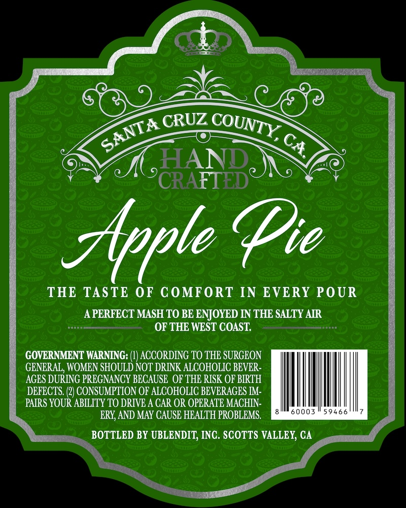
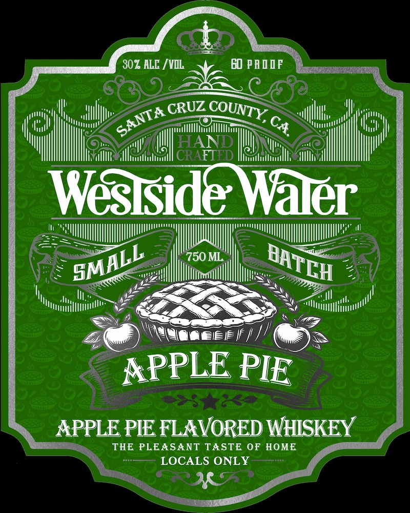

# TTB COLA Label Images - TTBID 26077001000887

**Brand Name:** WESTSIDE WATER

**Fanciful Name:** APPLE PIE FLAVORED WHISKEY

**Issue Date:** 03/20/2026

**Origin Code:** 01

**Product Class/Type:** 149

**Source:** [TTB Public COLA Registry](https://ttbonline.gov/colasonline/viewColaDetails.do?action=publicFormDisplay&ttbid=26077001000887)

## Label Images

### Back Label

### Front Label

## Extracted Label Text

*Text extracted via OCR - may contain errors*

### Back Label

CRUZ
HAND
N
CRAFTED
Appte Die
THE TASTE 0F COMFORT IN EVERY POUR
APERFECT MASH TO BE ENJOYED IN THE SALTY AIR
OF THE WEST COAST:
GOVERNMENT WARNING:
ACCORDING TO THE SURGEON
GENERAL, WOMEN SHOULD NOT DRINK ALCOHOLIC BEVER-
AGES DURING PREGNANCY BECAUSE  OF THE RISK OF BIRTH
DEFECTS
CONSUMPTION OF ALCOHOLIC BEVERAGES IM:
PAIRS YOUR ABILITY TO DRIVE A CAR OR OPERATE MACHIN-
ERY, AND MAY CAUSE HEALTH PROBLEMS.
0003
5 9 4
BOTTLED BY UBLENDIT; INC. SCOTTS VALLEY; CA
COUNTY,
SANTA
CA.

### Front Label

302 ALE /VIL
GO PADIF
HAND
CRAFTED
Wesiside Waler
750 ML
EieIF | /
APPLE
APPLE PIE FLAVORED WHISKEY
THE PLEASANT TASTE OF HOME
LOCALS ONLY
CRUZ
COUNTY,
SANTA=
CA.
SMALL
BATEH
PIE
