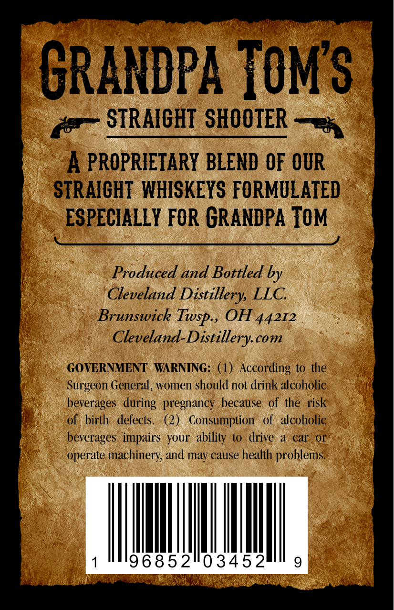
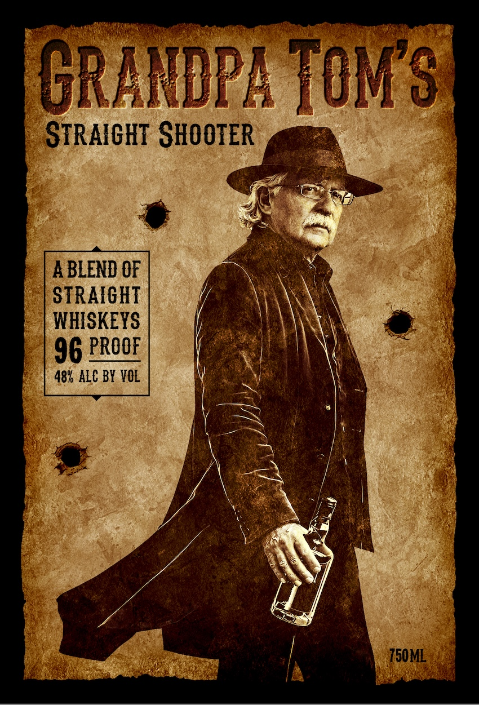

# TTB COLA Label Images - TTBID 26077001001017

**Brand Name:** GRANDPA TOM'S

**Fanciful Name:** STRAIGHT SHOOTER

**Issue Date:** 03/25/2026

**Origin Code:** 09

**Product Class/Type:** 109

**Source:** [TTB Public COLA Registry](https://ttbonline.gov/colasonline/viewColaDetails.do?action=publicFormDisplay&ttbid=26077001001017)

## Label Images

### Back Label

### Front Label

## Extracted Label Text

*Text extracted via OCR - may contain errors*

**Detected Proof:** 96

### Back Label

GRANDPA TOM $
STRAFGHT SHOOTER
4 PROPRIETARY BLEND OF OUR
STRAICHT  WHISKEYS FORMULATED
ESPECLALLY FOR GRANDPA TOM
Produced and Bottled by
Cleveland Distillery LLC
Brunswick
OH 44212
Cleveland-Distillery com
GOVERNMENT
WARNING: (1) According to the
Surgeon General, women should not drink alcoholic
beverages   during   pregnancy  because of the risk
of   birth   defects.
(2)
Consumption
of   alcoholic
beverages   impairs  your  ability
to   drive
car
or
operate machinery; and may cause health problems.
"96852103452
9
Twsp ,

### Front Label

GRANDPA TOM $
STRAXGHT SHOOTER
A BLEND OF
STRAFGHT
WHISKEYS
96 PROOF
48% ALC BY VOL
750ML
