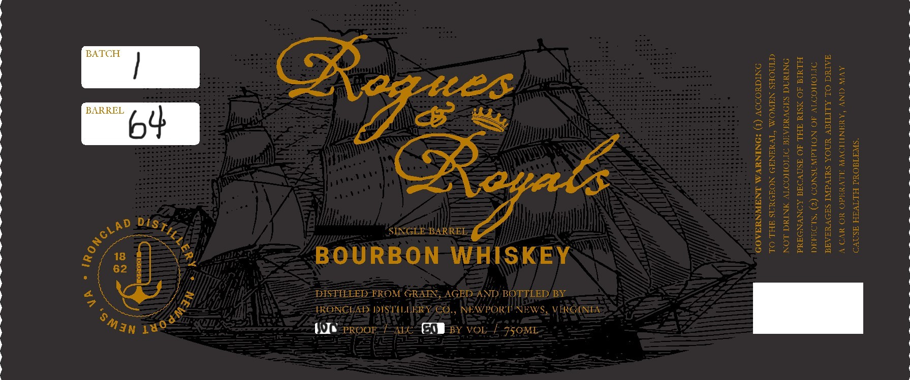

# TTB COLA Label Images - TTBID 26078001000110

**Brand Name:** ROGUES AND ROYALS

**Issue Date:** 03/25/2026

**Origin Code:** 05

**Product Class/Type:** 141

**Source:** [TTB Public COLA Registry](https://ttbonline.gov/colasonline/viewColaDetails.do?action=publicFormDisplay&ttbid=26078001000110)

## Label Images

### Label 1

## Extracted Label Text

*Text extracted via OCR - may contain errors*

### Label 1

b4 Se

SINGLE-BARREL >

BOURBON WHISKEY

DISTILLED FROM GRAIN, AGED=ANI) BOTTLED BY
TRONGBAD ID1S TILLER YSCO., NEWPORT NEWS, V ERGINEA

(Me Proor arc“ EMBesy vou/ 750mi

GOVERNMENT WARNING:

TO THE Sst

RAGES IMPAIRS YOUR ABILITY

NOT DRINK.
