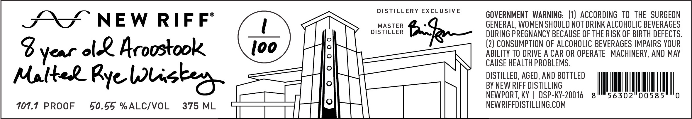

# TTB COLA Label Images - TTBID 26078001000174

**Brand Name:** NEW RIFF

**Issue Date:** 03/19/2026

**Origin Code:** 22

**Product Class/Type:** 142

**Source:** [TTB Public COLA Registry](https://ttbonline.gov/colasonline/viewColaDetails.do?action=publicFormDisplay&ttbid=26078001000174)

## Label Images

### Front Label

## Extracted Label Text

*Text extracted via OCR - may contain errors*

**Detected Proof:** 107.7

### Front Label

DISTILLERY EXCLUSIVE

GOVERNMENT WARNING: (1) ACCORDING TO THE SURGEON

SS NEW RIFF

MASTER

GENERAL, WOMEN SHOULD NOT DRINK ALCOHOLIC BEVERAGES

DISTILLER

ia

DURING PREGNANCY BECAUSE OF THE RISK OF BIRTH DEFECTS

i

(2) CONSUMPTION OF ALCOHOLIC BEVERAGES IMPAIRS YOUR

3S year ol Aroostoole

Gls) f

ABILITY TO DRIVE A CAR OR OPERATE MACHINERY, AND MAY

CAUSE HEALTH PROBLEMS

DISTILLED, AGED, AND BOTTLED

BY NEW RIFF DISTILLING

Methek Rye Wicker

NEWPORT, KY | DSP-KY-20016 8

NM,

56302

107.7 PROOF

50.55 %ALC/VOL

375 ML

ty ||

NEWRIFFDISTILLING.COM

mm

hy)
