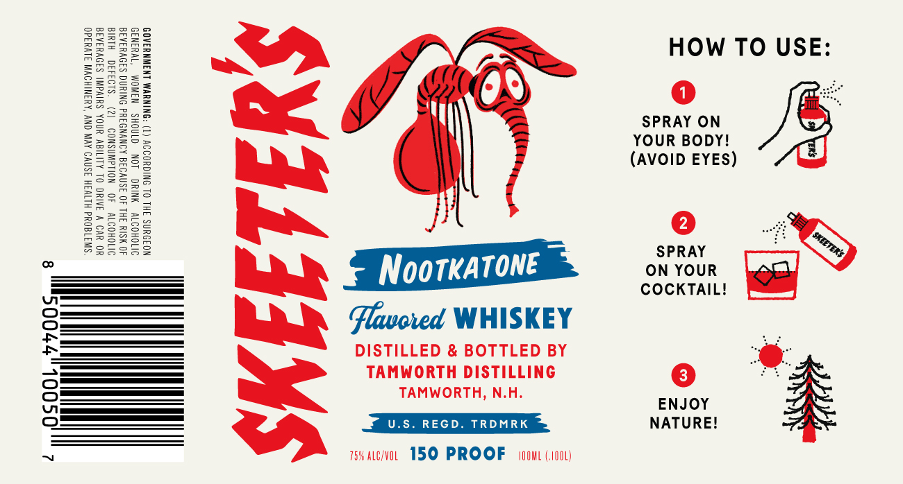

# TTB COLA Label Images - TTBID 26079001000044

**Brand Name:** SKEETER'S

**Issue Date:** 03/24/2026

**Origin Code:** 33

**Product Class/Type:** 149

**Source:** [TTB Public COLA Registry](https://ttbonline.gov/colasonline/viewColaDetails.do?action=publicFormDisplay&ttbid=26079001000044)

## Label Images

### Label 1

## Extracted Label Text

*Text extracted via OCR - may contain errors*

**Detected Proof:** 150

### Label 1

HXW
HOw To USE:
KH
32
Je
SPRAY ON
0
YOUR BODY!
0
1
2
1
(AVOID EYES)
1
0i
49
1
4
4
1
8
1
2
0
1
NootKatone
osproUR
COCKTAILI
2
Flavcted WHISKEY
DISTiLLED & BOTTLED BY
TAMWORTH Distilling
3
TAMWORTH; N.H;
ENJOY
U.S. REGD _
TRDMRK
NATUREI
758 Alc/VOL   150 PROOF
IOML (oOl)
SKEETERs
