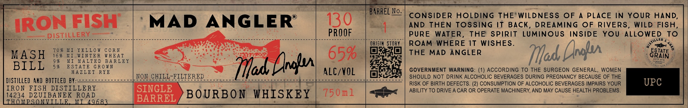

# TTB COLA Label Images - TTBID 26079001000045

**Brand Name:** MAD ANGLER

**Issue Date:** 03/20/2026

**Origin Code:** 06

**Product Class/Type:** 141

**Source:** [TTB Public COLA Registry](https://ttbonline.gov/colasonline/viewColaDetails.do?action=publicFormDisplay&ttbid=26079001000045)

## Label Images

### Label 1

## Extracted Label Text

*Text extracted via OCR - may contain errors*

**Detected Proof:** 130

### Label 1

==

ARREL No

CONSIDER HOLDING THE*WILDNESS OF A PLACE IN YOUR HAND,

130

AND THEN TOSSING IT BACK, DREAMING OF RIVERS, WILD FISH,

MIRON FISH ‘MAD ANGLER

= DISTILLER

PURE WATER, THE SPIRIT LUMINOUS Yaoi) YOU ALLOWED TO

SE RIMES oe cr A a eae

fr,

rns ||

ORIGIN STORY

gtoy

+

70% MI YELLOW CORN

aye

gue

ROAM WHERE IT WISHES.

1

MASH

16% MI WINTER WHEA

TPIS)

THE MAD ANGLER

io

ESTATE

9%

M

ALTED BARLEY

=

65%

BILL

5%

ES

TATE GROWN

GOVERNMENT WARNING: (1) ACCORDING TO THE SURGEON GENERAL, WOMEN

HAZLET RYE

NON CHILL-FILTERED

bf Ae

ALC/VOL

Bsc

SHOULD NOT DRINK ALCOHOLIC BEVERAGES DURING PREGNANCY BECAUSE OF THE

DISTILLED AKD BOTTLED BY:

Pee ~~ ~~ ~~ ee ae ee oe

Foleo ae oe a

RISK OF BIRTH DEFECTS. (2) CONSUMPTION OF ALCOHOLIC BEVERAGES IMPAIRS YOUR

IRON FISH DISTILLERY

SINGLE

ABILITY TO DRIVE A CAR OR OPERATE MACHINERY, AND MAY CAUSE HEALTH PROBLEMS.

14234 DZUIBANEK ioe

BOURBON WHISKEY

750m1

HOMPSON

68

BARREL
