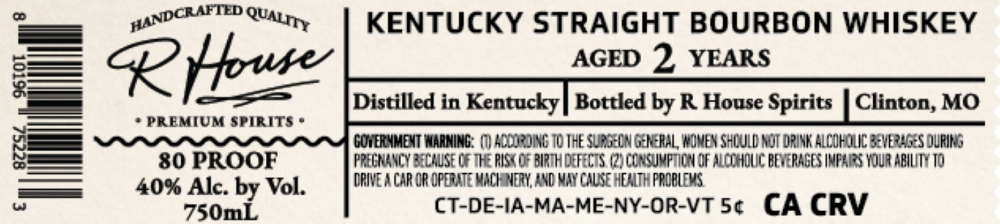
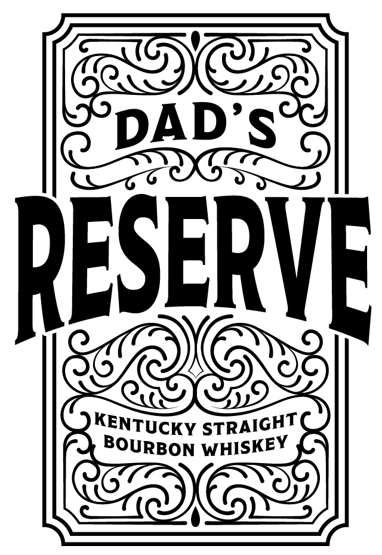

# TTB COLA Label Images - TTBID 26079001000077

**Brand Name:** R HOUSE

**Issue Date:** 04/01/2026

**Origin Code:** 22

**Product Class/Type:** 101

**Source:** [TTB Public COLA Registry](https://ttbonline.gov/colasonline/viewColaDetails.do?action=publicFormDisplay&ttbid=26079001000077)

## Label Images

### Back Label

### Front Label

## Extracted Label Text

*Text extracted via OCR - may contain errors*

**Detected Proof:** 80
**Detected Age:** 2 Years

### Back Label

_— panDRAbim WAL rry KENTUCKY STRAIGHT BOURBON WHISKEY

— R Houser AGED 2 YEARS

i: — = S—= _[ Distilled in Kentucky | Bottled by R House Spirits | Clinton, MO
—— * PREMIUM SPIRITS °

E GOVERNMENT WARNING: (7) ADOURDING TD THE SURGEDN GENERAL, WOMEN SHOULD NOT ORINK ALCOHOLIC BEVERAGES QURING

an 80 PROOF PREGNANCY BECAUSE OF THE RISK OF BIRTH DEFECTS. (2) CONSUMPTION OF ALCOHOUC BEVERAGES INPAIRS YOUR ABILITY TO
——— 40% Alc. by Vol. | PAVEACAROROPERATE MACINERY AND WAY CAUSE HEATH PROBLEMS

rea 750mL CT-DE-IA-MA-ME-NY-OR-VT 5¢ CA CRV

### Front Label

Gas

DAD'S

CRIED

DESERVE

KENTU

IC

CKy STRAIGHT

BOURBON WHISKEY
