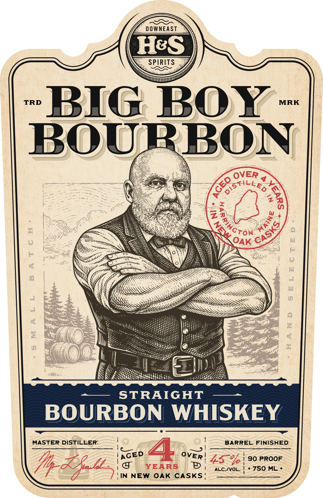
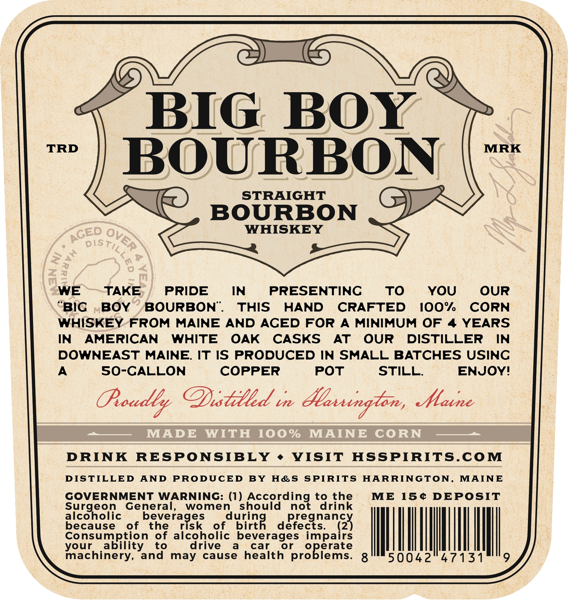

# TTB COLA Label Images - TTBID 26079001000208

**Brand Name:** H&S SPIRITS

**Fanciful Name:** BIG BOY BOURBON

**Issue Date:** 03/20/2026

**Origin Code:** 24

**Product Class/Type:** 101

**Source:** [TTB Public COLA Registry](https://ttbonline.gov/colasonline/viewColaDetails.do?action=publicFormDisplay&ttbid=26079001000208)

## Label Images

### Front Label

### Label 2

## Extracted Label Text

*Text extracted via OCR - may contain errors*

*1 image(s) excluded: text did not meet readability threshold*

**Detected Age:** 4 Years

### Label 2

BIG
BOY
TRD
MRK
BOURBON
STRAIGHT
BOURBON
WHISKEY
DIS
m
WE
TAKE
PRIDE
IN
PRESENTINC
TO
YOU
OUR
BIC
BOY
BOURBON".
THIS
HAND
CRAFTED
I0O%
CORN
WHISKEY
FROM
MAINE
AND ACED FOR
A
MINIMUM OF
4 YEARS
IN
AMERICAN
WHITE
OAK
CASKS
AT
OUR
DISTILLER
IN
DOWNEAST
MAINE: IT IS PRODUCED IN SMALL BATCHES USINC
50-CALLON
COPPER
POT
STILL;
ENJOY!
Ooadby @istilld in &laxungton,
Malne
MADE
WITH
100 %
MAINE
CORN
DRINK
RESPONSIBLY
VISIT
HSSPIRITS.COM
DIS TILLED
AND
PRODUCED
BY
Hes
SPIRITS
HARRINGTON,
MAINE
GOVERNMENT
WARNING: (1)
hcc%adino?
to the
ME
15@
DEPOSIT
Surgeon
General,
women
should
drink
beatgec
of
beneragses
risk
of
duiing   defeegsanz}
Consumption
of alcoholic beverages impairs
your
ability
to
drive
a
car
or
machinery,
and
may
cause
health
pr8Beertse
8
50042
47131
ACED
OVER
}
{
3
