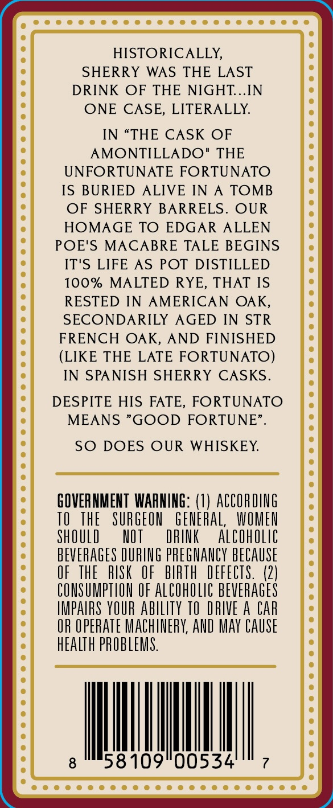
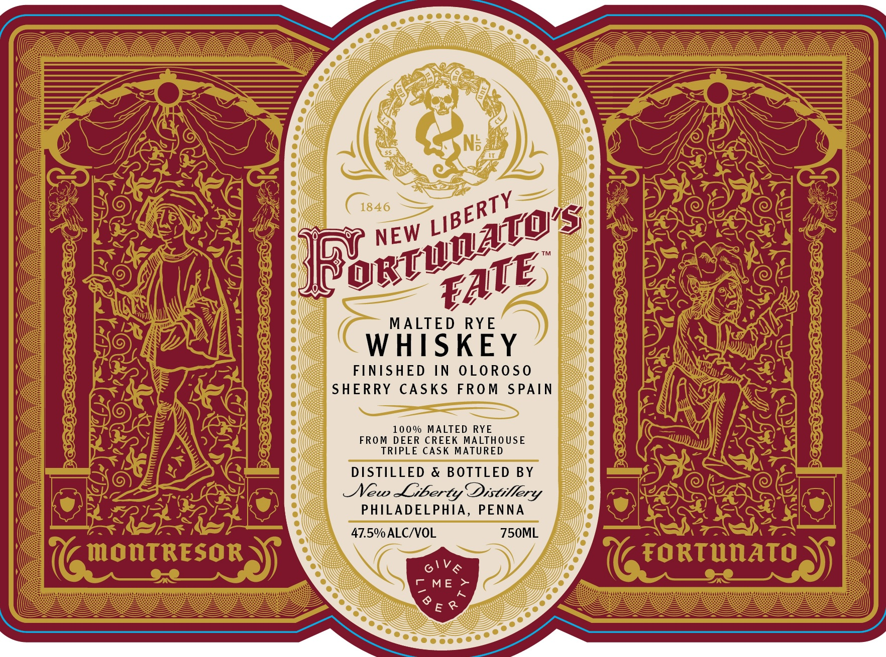
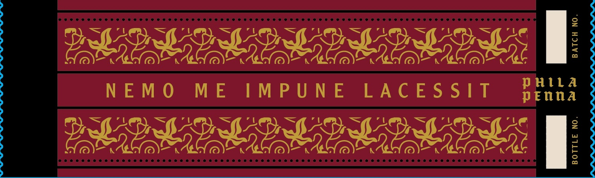

# TTB COLA Label Images - TTBID 26079001000227

**Brand Name:** FORTUNATO'S FATE

**Issue Date:** 03/20/2026

**Origin Code:** 39

**Product Class/Type:** 142

**Source:** [TTB Public COLA Registry](https://ttbonline.gov/colasonline/viewColaDetails.do?action=publicFormDisplay&ttbid=26079001000227)

## Label Images

### Back Label

### Front Label

### Label 3

## Extracted Label Text

*Text extracted via OCR - may contain errors*

**Detected Proof:** 95

### Back Label

HISTORICALLY,
SHERRY
WAS THE LAST
DRINK
OF THE NIGHT.IN
ONE CASE, LITERALLY:
IN "THE CASK OF
AMONTILLADO"
THE
UNFORTUNATE FORTUNATO
IS BURIED ALIVE IN
TOMB
OF SHERRY BARRELS. OUR
HOMAGE TO EDGAR ALLEN
POE'S MACABRE TALE BEGINS
IT'S LIFE
AS POT DISTILLED
100%
MALTED RYE, THAT IS
RESTED IN
AMERICAN OAK,
SECONDARILY AGED IN STR
FRENCH OAK,
AND FINISHED
(LIKE THE LATE FORTUNATO)
IN SPANISH SHERRY CASKS.
DESPITE HIS FATE, FORTUNATO
MEANS "GOOD FORTUNE" .
SO
DOES OUR WHISKEY
GOVERNMENT  WAANING: (1) ACCOrdg
TO
THE
SURGEOU
GENERAL;
WOMEN
ShOuLI
NOT
DRINK
alCoholic
BEVERAGES DURING pREGHANCY BECAUSE
OF  THE
RISK
OF
bIRTH DEFECTS.   (2|
CONSUMPTLON OF alcoholc BEVERAGES
IMPAIRS YOUR abiliTy TO DRIVE A CAR
OR OPERATe MACHIERY AnD MaY CAUSE
hEaLTh pROBLEMS
58 109"00534

### Front Label

MALTED RYE

WHISKEY

FINISHED IN OLOROSO
SHERRY CASKS FROM SPAIN

100% MALTED RYE
FROM DEER CREEK MALTHOUSE
TRIPLE CASK MATURED
DISTILLED & BOTTLED BY
Mew Liberty Distillery
PHILADELPHIA, PENNA

47.5% ALC/VOL 750ML

### Label 3

BGO ISIC CISCO IC IO Or ICCC OIC NCO CU Ci ein iron

eee e mea m cee eae meee sees eee cena desea ese een eae sass ease nesses nsansaseseassasesesasee
