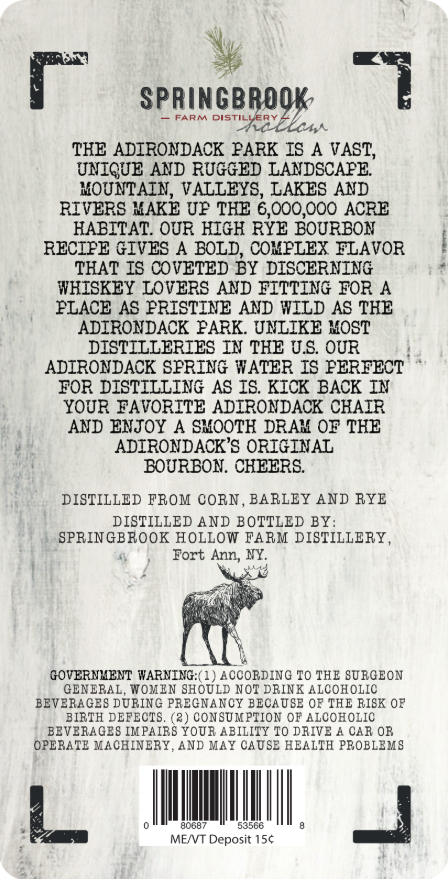
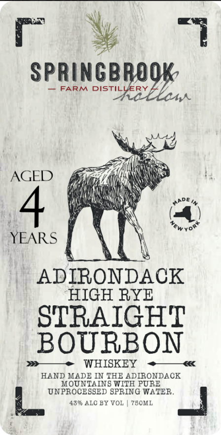

# TTB COLA Label Images - TTBID 26079001000264

**Brand Name:** HIGH RYE 4YR

**Fanciful Name:** HR4YR

**Issue Date:** 03/20/2026

**Origin Code:** 02

**Product Class/Type:** 101

**Source:** [TTB Public COLA Registry](https://ttbonline.gov/colasonline/viewColaDetails.do?action=publicFormDisplay&ttbid=26079001000264)

## Label Images

### Back Label

### Label 1

## Extracted Label Text

*Text extracted via OCR - may contain errors*

**Detected Age:** 4 Years

### Back Label

Springbrook
Fid
DISTILCERT
TL0
LCAA
TKE ADIRONDACK PARK IS A VAST,
UNIQUE AND RUGGED LANDSCAFE
KOUNTAIN, VALLEYS, LAKES AND
RIVERS KAKE UP TKE 6,000,000 ACRE
KABITAT OUR HIGK RYE BOURBON
RECIPE GIVES A BOLD, COXPLEX FLAVOR
THAT IS COVETED BY DISCERNING
WKISKEY LOVERS AND FITTING FOR A
PLACE AS PRISTINE AND WILD AS TKE
ADIRONDACK FARK. UNLIKE IOST
DISTILLERIES IN THE US OUR
ADIRONDACK SPRING WATER IS PERFECT
FOR DISTILLING AS IS KICK BACK IN
YOUR FAVORITE ADIRONDACK CHAIR
AND ENJOY A SHOOTH DRAX OF TKE
ADIRONDACK 'S ORIGINAL
BOURBON . CHEERS
DISTILLED FROM CORN
BARLEY AND RYE
DISTILLED AND BOTTLED BY:
SPRINGBROOK HOLLOW FARM DISTILLERY
Fort Ann, NY_
GOVERNMENT WARNING:( 1) ACCOBDING TO THE SURGEON
GENERAL
WOMEN SHOULD NOT DRINK ALCOHOLIC
BEVERAGES DUBING PrECNanCY BECAUSE OF THE RISK 0F
BIRTH DEFECTS
(2) CONSUMPTION OF ALCOHOLIC
BEVERAGES IKPAIBS YoUR ABILITY To DRIVE A CAR OB
OPEBATE MACHINERY
AND MAY CAUSE HEALTH PBOELEMS
Lnk
MENT Deposit 154

### Label 1

SpRingBRoOk
FARM DISTILLERY
""YeB-ELm
AGED
4
YEARS
ADIRONDACK
HIGH RYE
STRAIGHT
BOURBON
WHISKEY
HAND MADE IN THE ADIRONDACK
MOUNTAINS WITH PURE
UNPROCESSED SPRING WATER
439 ALC BY VOL
750ML
