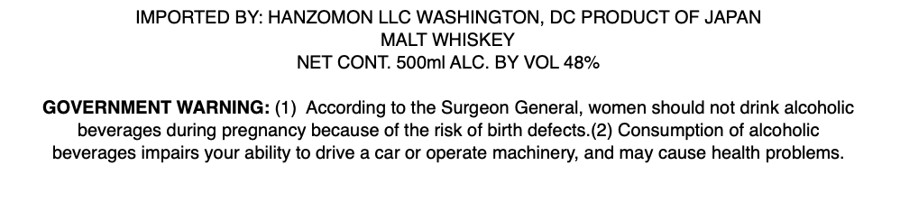
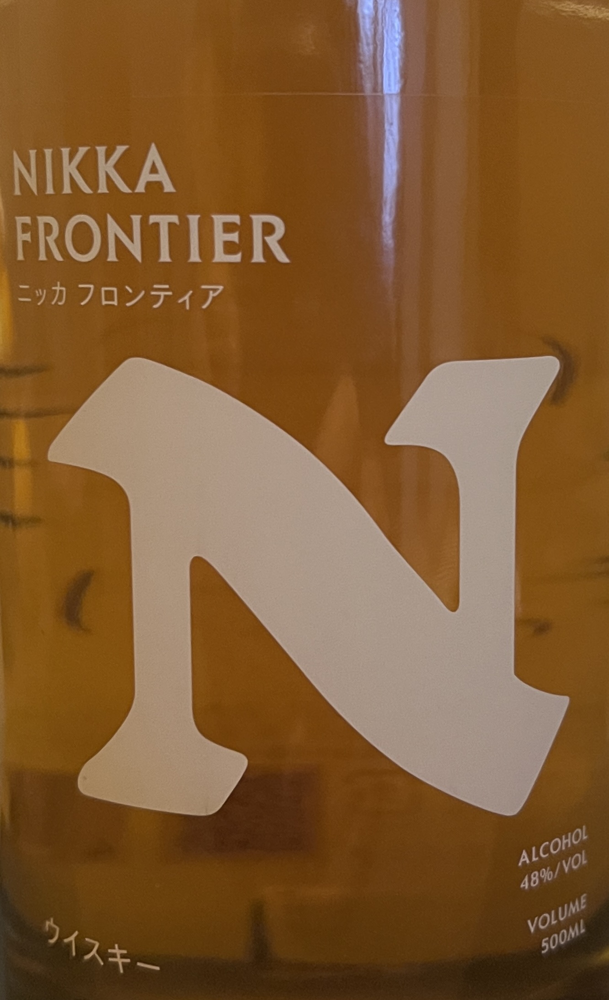

# TTB COLA Label Images - TTBID 26079001000404

**Brand Name:** NIKKA

**Fanciful Name:** FRONTIER

**Issue Date:** 04/15/2026

**Origin Code:** 59

**Product Class/Type:** 118

**Source:** [TTB Public COLA Registry](https://ttbonline.gov/colasonline/viewColaDetails.do?action=publicFormDisplay&ttbid=26079001000404)

## Label Images

### Front Label

### Label 1

## Extracted Label Text

*Text extracted via OCR - may contain errors*

**Detected Proof:** 96

### Front Label

IMPORTED BY: HANZOMON LLC WASHINGTON, DC PRODUCT OF JAPAN

MALT WHISKEY

NET CONT. 500ml ALC. BY VOL 48%

GOVERNMENT WARNING: (1) According to the Surgeon General, women should not drink alcoholic

beverages during pregnancy because of the risk of birth defects.(2) Consumption of alcoholic

beverages impairs your ability to drive a car or operate machinery, and may cause health problems.

### Label 1

NIKKA
FRONTIER
-9170/547
ALCOHOL
4896/VOL
VOLUME
SOOML
547* -
