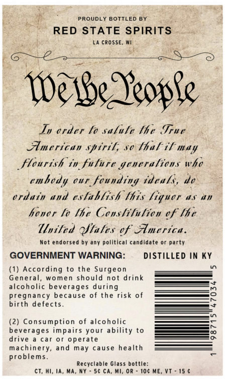
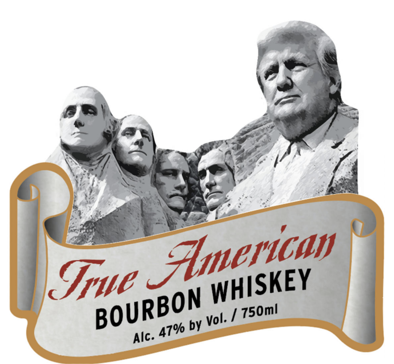

# TTB COLA Label Images - TTBID 26079001000424

**Brand Name:** TRUE AMERICAN

**Issue Date:** 03/24/2026

**Origin Code:** 48

**Product Class/Type:** 141

**Source:** [TTB Public COLA Registry](https://ttbonline.gov/colasonline/viewColaDetails.do?action=publicFormDisplay&ttbid=26079001000424)

## Label Images

### Back Label

### Front Label

## Extracted Label Text

*Text extracted via OCR - may contain errors*

### Back Label

PROUDLY BOTTLED BY

~ RED STATE SPIRITS

LA CROSSE, WI

Wee Reowle

In order to salute the True
American spirtl, so thal tf may

Stourtsh in fulare generations whe
embody our founding tdeals, de
ordaty and establish lhis liquor as an
hover fo lhe Constitution of lhe
United Sales of America.

Not endorsed by any political candidate or party

GOVERNMENT WARNING: DISTILLED IN KY

(1) According to the Surgeon
General, women should not drink
alcoholic beverages during
pregnancy because of the risk of
birth defects

(2) Consumption of alcoholic
beverages impairs your ability to
drive a car or operate
machinery, and may cause health
problems.

Recyclable Glass bottle:
CT, HI, IA, MA, NY = 56 CA, MI, OR - 10¢ ME, VT - 15 ¢

### Front Label

¥

—

inf

\.

ern

é

ae Le

We

Stl

W

WHISKEY

vol i] 750m!
