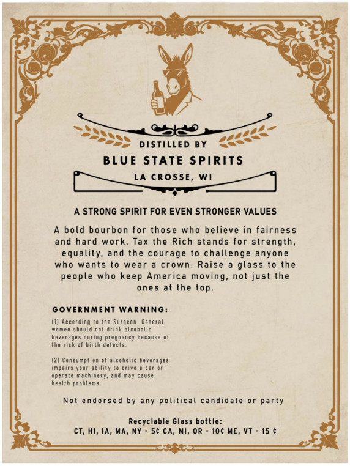
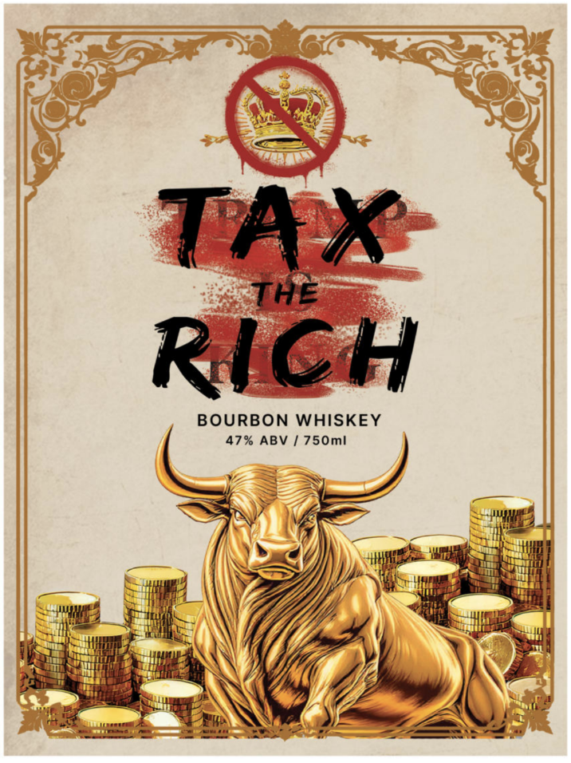

# TTB COLA Label Images - TTBID 26079001000465

**Brand Name:** TAX THE RICH

**Issue Date:** 04/10/2026

**Origin Code:** 48

**Product Class/Type:** 141

**Source:** [TTB Public COLA Registry](https://ttbonline.gov/colasonline/viewColaDetails.do?action=publicFormDisplay&ttbid=26079001000465)

## Label Images

### Back Label

### Front Label

## Extracted Label Text

*Text extracted via OCR - may contain errors*

*1 image(s) excluded: text did not meet readability threshold*

### Back Label

Sa i
SSSNN —— yrTUS

“eS pistitiep By <<~

BLUE STATE SPIRITS

(fates LA CROSSE, WI aati

A STRONG SPIRIT FOR EVEN STRONGER VALUES

A bold bourbon for those who believe in fairness

and hard work. Tax the Rich stands for strength,
equality, and the courage to challenge anyone
who wants to wear a crown. Raise a glass to the
people who keep America moving, not just the
ones at the top.

GOVERNMENT WARNING:

(1) According to the Surgeon Genera,
women thould net érink sleehelic
beverages during pregnancy because of
the risk of birth defects

(2) Consumption of alcoholic beverages
impairs your ability te drive a car er
aperate machinery, and may cause
health problems

Not endorsed by any political candidate or party

Recyclable Glass bottle:

CT, HI, 1A, MA, NY ~ 5¢ CA, MI, OR = 106 ME, VT - 15 ¢
