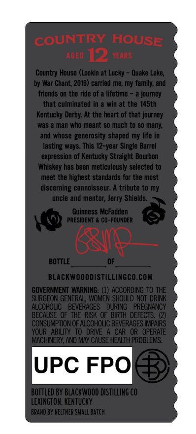
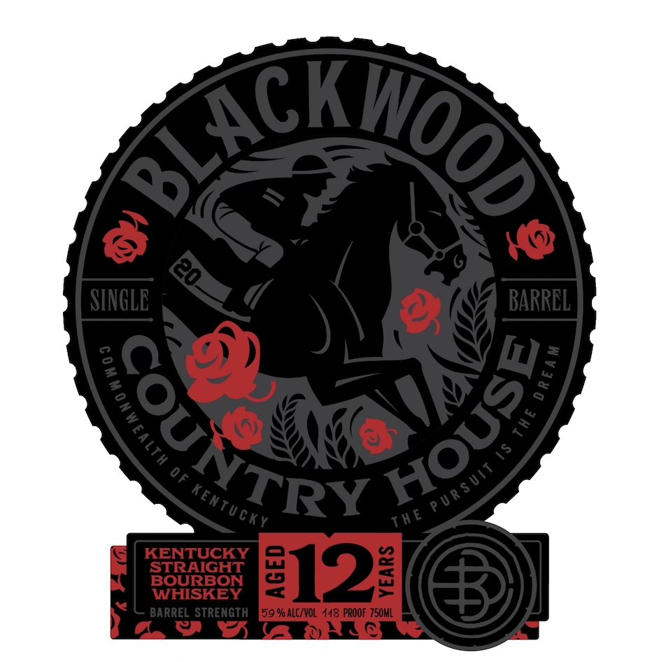
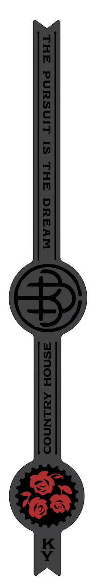

# TTB COLA Label Images - TTBID 26079001000669

**Brand Name:** BLACKWOOD

**Issue Date:** 03/23/2026

**Origin Code:** 22

**Product Class/Type:** 101

**Source:** [TTB Public COLA Registry](https://ttbonline.gov/colasonline/viewColaDetails.do?action=publicFormDisplay&ttbid=26079001000669)

## Label Images

### Back Label

### Front Label

### Label 3

## Extracted Label Text

*Text extracted via OCR - may contain errors*

*1 image(s) excluded: text did not meet readability threshold*

**Detected Proof:** 118

### Back Label

COUNTRY HOUSE
AGEd
12
VeARS
Country House (Lookin at Lucky
Quake Lake;
by War Chant; 2016) carried me; my family; and
friends on the ride of
lifetime
journey
that culminated in
win at the I45th
Kentucky Derby: At the heart of that journey
Was
man who meant so much to so many;
whose generosity shaped my Iife in
lasting ways: This
'Single Barrel
expression of Kentucky Straight Bourbon
Whiskey has been meticulously selected to
meet the highest standards for the most
discerning connoisseur:
trbute to my
uncle and mentor; Jerry Shields:
Guinness McFadden
PRESIDENT
Co-FOUNDER
G10
BOTTLE
BLACKWOODDISTILLINGCO.COM
GOVERNMENT WARNING:
ACCORDING TO THE
SURGEON GENERAL; WoMEn SHOULD NOT  DRINK
ALCOHOLC   BEVERAGES
DURING   PREGNANCY
BECAUSE  OF  THE RISK OF  BIRTH  DEFECTS:
CONSUMPTION OF ALCOHOLIC BEVERAGES IMPAIRS
YOUR   ABILITY  TO DRIVE A CAR OR  OPERATE
MACHINERY, AND MAY CAUSE HEALTH PROBLEMS.
UPC FPO
Bottled BY BLACKWOOD DISTILLING CO
LEXINGTOH, KENTUCKY
BRARD BY Nelther SMall BATCh^
and
412-year

### Front Label

Sackiog
SINGLE
BARREL
6
0f
KENTUCKY
SOURGON
E12
WHISKEY
BARREL STRENGTH
59 % ALC/VOL  448 PROOF 750ML
3
COUNTR (
L
3
=
PU R $ UiT
KenTuckv
Th E
