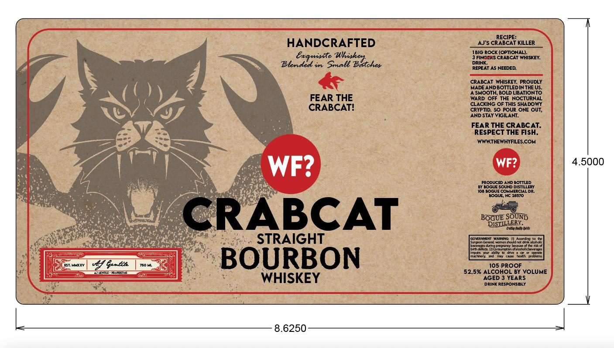
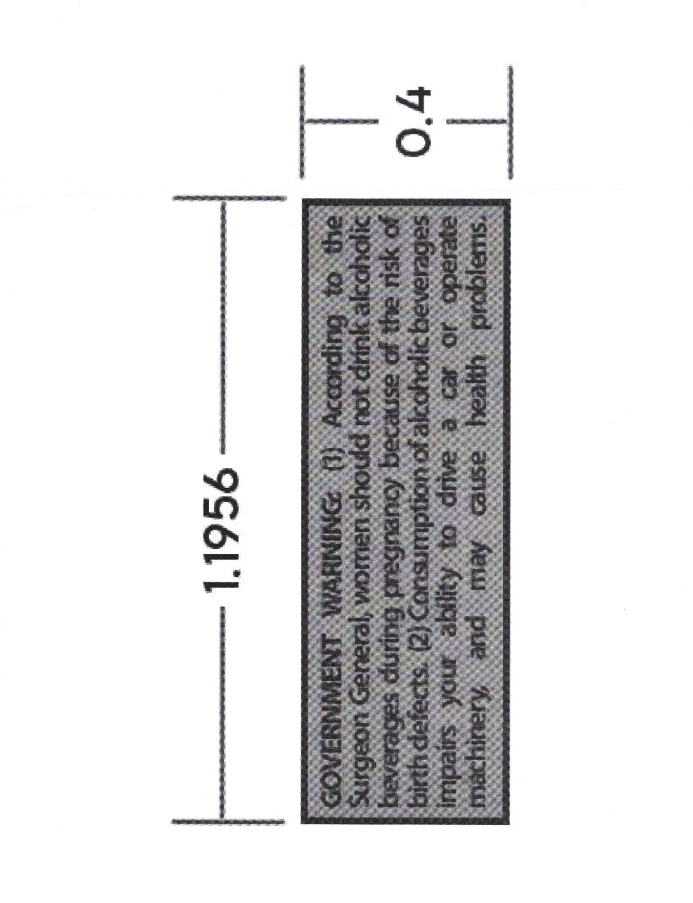

# TTB COLA Label Images - TTBID 26080001000012

**Brand Name:** CRABCAT STRAIGHT BOURBON WHISKEY

**Issue Date:** 03/23/2026

**Origin Code:** 35

**Product Class/Type:** 101

**Source:** [TTB Public COLA Registry](https://ttbonline.gov/colasonline/viewColaDetails.do?action=publicFormDisplay&ttbid=26080001000012)

## Label Images

### Label 1

### Label 2

## Extracted Label Text

*Text extracted via OCR - may contain errors*

*1 image(s) excluded: text did not meet readability threshold*

**Detected Proof:** 105
**Detected Age:** 3 Years

### Label 1

RECIPE:
HANDCRAFTED
AJ'S CRABCAT KILLER
IBIG ROCK (OPTIONALI.
Enrmiste
Zuhi gachor
DRINK"R5
CRABCAT WHISKEY:
Blended i Small
REPEAT AS NEEDED:
CRABCAT WHISKEY: PROUDLY
MADE ANDBOTTLED IN THE Us:
ASMOOTH, BOLD LIBATIONTO
FEAR THE
WARD
OFF THE NOCTURNAL
CRABCAT?
CLACKING OF THIS SHADOWY
CRYPTID: SO POUR ONE OUT;
AND STAY VKGILANT.
FEAR THE CRABCAT:
RESPECT THE FISH.
WWWTHEWHYFILESCOM
WF?
WF?
4.5000
PRODUCED AND BOTTLED
BY BOGUE SOUND DISTILLERY
TOC ROGURCOMMFRCILDR
BOGUE NC 28570
CRABCAT
BOH381
Daty Raen
STRAIGHT
IckEAECN
AaaHEIG
Jeprd 1J
Laro Onntinen
Comenkit
Dordene
Ooon
0377317,
inide
dnsuto
Toiintioer
MElIUS
27345
mrnner;
Wntian
Ootein
EST: MAXXY
%/04
750 HL
BOURBON
105 PROOF
AGehine
MOlCEcD
52.5% ALCOHOL BY VOLUME
WHISKEY
AGED 3 YEARS
DRINK RESPONSMLY
8.6250
Bs
