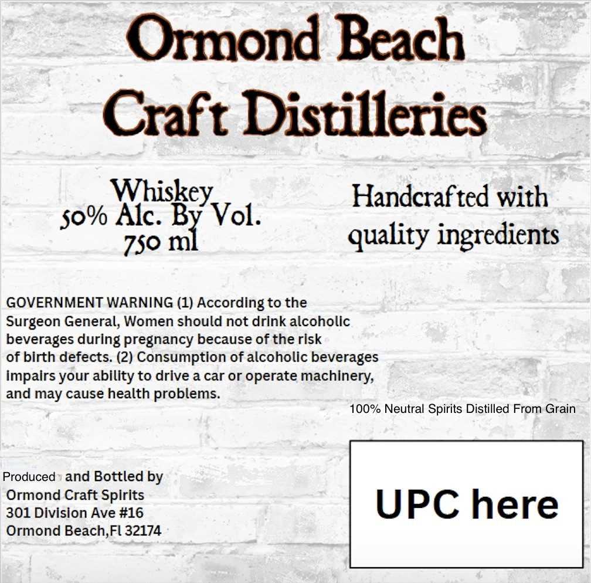
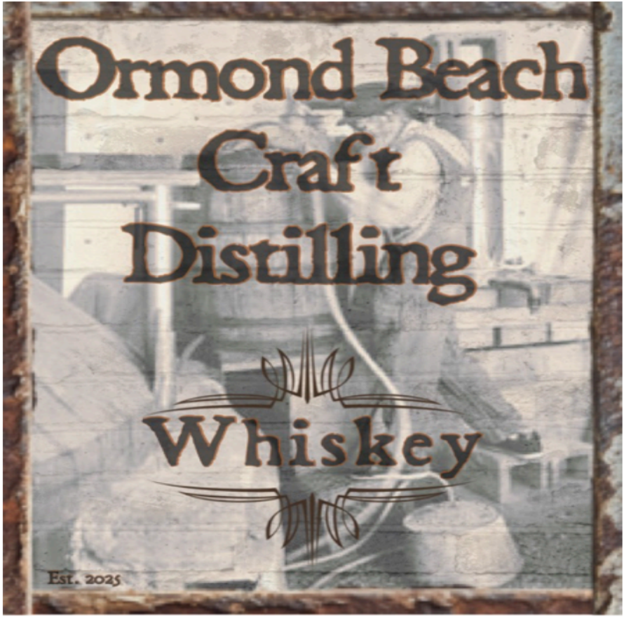

# TTB COLA Label Images - TTBID 26080001000057

**Brand Name:** ORMOND BEACH CRAFT DISTILLING

**Issue Date:** 03/23/2026

**Origin Code:** 16

**Product Class/Type:** 140

**Source:** [TTB Public COLA Registry](https://ttbonline.gov/colasonline/viewColaDetails.do?action=publicFormDisplay&ttbid=26080001000057)

## Label Images

### Back Label

### Front Label

## Extracted Label Text

*Text extracted via OCR - may contain errors*

### Back Label

Ormond Beach
Craft Distilleries
Whiskey;
Handcrafted with
Alc. By Vol.
750 ml
quality ingredients
GOVERNMENT WARNING (1) According to the
Surgeon General, Women should not drink alcoholic
beverages during pregnancy because of the risk
of birth defects (2) Consumption of alcoholic beverages
Impalrs your ability to drive a car or operate machinery;
and may cause health problems:
100% Neutral Spirits Distilled From Grain
Produced
and Bottled by
Ormond Craft Spirits
301 Division Ave #16
UPC here
Ormond Beach,Fl 32174
So%

### Front Label

Ormond Bach
Craft
Distilling
Whiskey
ESt. 2025
