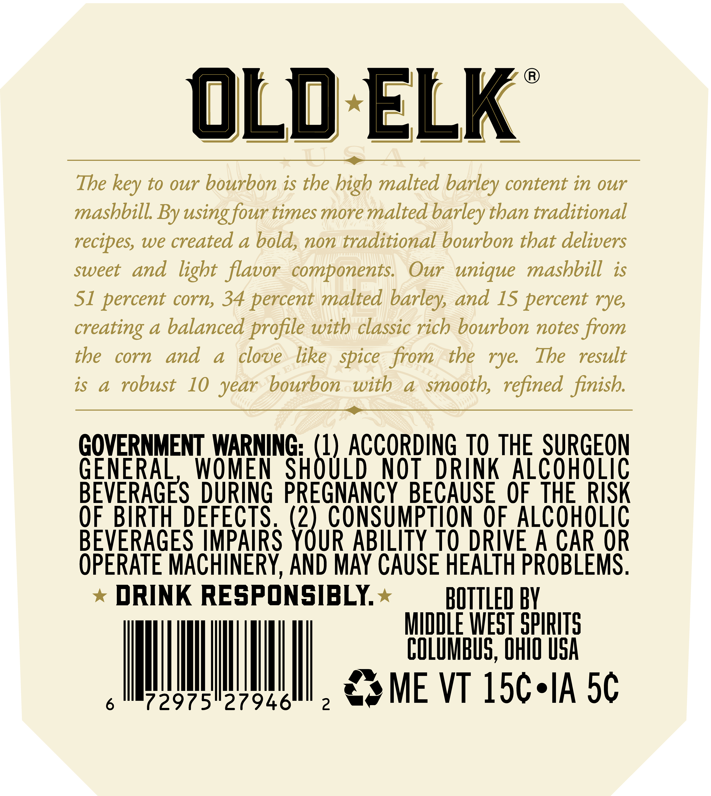
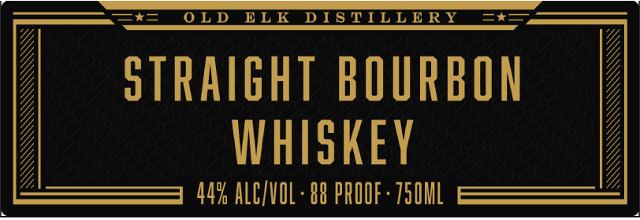

# TTB COLA Label Images - TTBID 26081001000027

**Brand Name:** OLD ELK

**Issue Date:** 03/24/2026

**Origin Code:** 09

**Product Class/Type:** 101

**Source:** [TTB Public COLA Registry](https://ttbonline.gov/colasonline/viewColaDetails.do?action=publicFormDisplay&ttbid=26081001000027)

## Label Images

### Back Label

### Front Label

### Label 4

## Extracted Label Text

*Text extracted via OCR - may contain errors*

*1 image(s) excluded: text did not meet readability threshold*

**Detected Proof:** 88

### Back Label

oLd ELK
The
to our bourbon is the high malted barley content in our
mashbill By using four times more malted
than traditional
recipes, we created a bold, non traditional bourbon that delivers
sweet
and light flavor
components:
Our   unique masbbill is
S1 percent corn, 34 percent malted
and 15 percent rye;
creating
a
balanced profile with classic rich bourbon notes from
tbe
corn
and
a
clove
like
from
tbe
rye:
The
result
is
a
robust
10
bourbon
with
1
smooth, refined finish:
GOVERNMENT WARNING; (1) ACCORDiNG TO THE SURGEON
GENERAL
WOMEN
SHOULD
NOT
DRINK AlcohoLiC
BEVERAGES DURING PREGNANCY BECAUSE OF  THERISK
OF_BIRTH DEFECTS  (2),CoNSumpTION OF.ALCOHOLIC
BEVERAGES IMPAIRS YOUR ABILITY TO DRIVE A CAR OR
OPERATE MACHINERY,AND MAY CAUSE HEALTH PROBLEMS ,
DRINK RESPONSIBLY
BOTTLED BY
MIDDLE WEST SPIRITS
co@uMbUs, OHo uSA
6
72975"27946
2
ME VT 15c.IA 5c
key
barley
barley;
spice
year

### Front Label

=*= OLD ELK DISTILLERY  =x=—,

STRAIGHT BOURBON
WHISKEY

44% ALC/VOL- 88 PROOF - 750ML

SF GGbb{b

MX GS GSA AN
