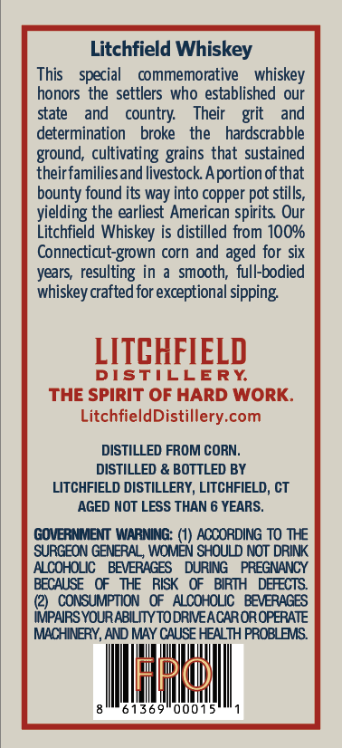
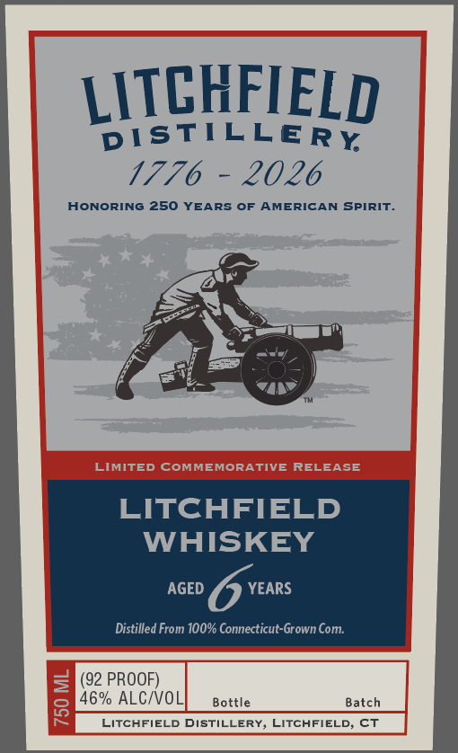

# TTB COLA Label Images - TTBID 26082001000083

**Brand Name:** LITCHFIELD DISTILLERY

**Issue Date:** 03/24/2026

**Origin Code:** 14

**Product Class/Type:** 140

**Source:** [TTB Public COLA Registry](https://ttbonline.gov/colasonline/viewColaDetails.do?action=publicFormDisplay&ttbid=26082001000083)

## Label Images

### Back Label

### Front Label

## Extracted Label Text

*Text extracted via OCR - may contain errors*

**Detected Proof:** 92
**Detected Age:** 6 Years

### Back Label

Litchfield Whiskey
This
special
commemorative
whiskey
honors the settlers who established our
state
and
country:
Their
grit
and
determination
broke
the
hardscrabble
ground; cultivating
that sustained
theirfamiliesand livestock Aportion ofthat
bounty found its way into copper pot stills,
yielding the earliest American spirits Our
Litchfield Whiskey is distilled from 10O%
Connecticut-grown corn
aged for six
years   resulting in
smooth;  full-bodied
whiskey crafted for exceptional sipping
LITCHFIELD
DISTILLERY
THE SPIRIT OF HARD WORK_
LitchfieldDistillery.com
DISTILLED FROM CORN;
DISTILLED & BOTTLED BY
LITCHFIELD DISTILLERY, LITCHFIELD, CT
AGED NOT LESS THAN 6 YEARS.
GOVERNMENT WARNING: (1) ACCORDING To TE
SURGEON GENERAL, WOMEN SHOULD NOT DRINK
ALCOHOLIC
BEVERAGES
DURING
PREGNANCY
BECAUSE
THE   RISK
BIRIH
DEFECTS
CONSUMPTION   OF   ALCOHOLIC   BEVERAGES
IMPAIRS YOURABILITY TO DRNEACAROROPERATE
MACHINERY, AND MAY CAUSE HEALTH PROBLEMS
lrd
6 9
00015
grains
and

### Front Label

LITCHFIELD
DISTICLERY
1776
2026
HONORING 250 YEARS OF AMERICAN SPIRIT _
LIMITED
COMMEMORATIVE
RELEASE
LITCHFIELD
WHISKEY
AGED
YEARS
Distilled From 100% Connecticut-Grown Com:
(92 PROOF)
8
46% ALCIVOL
Bottle
Batch
LITCHFIELD DISTILLERY
ITCHFIELD, CT
