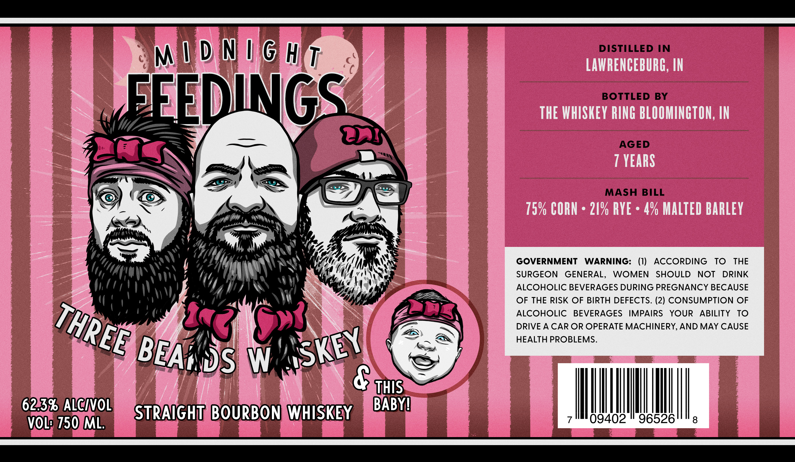

# TTB COLA Label Images - TTBID 26082001000099

**Brand Name:** MIDNIGHT FEEDINGS

**Issue Date:** 03/23/2026

**Origin Code:** 19

**Product Class/Type:** 101

**Source:** [TTB Public COLA Registry](https://ttbonline.gov/colasonline/viewColaDetails.do?action=publicFormDisplay&ttbid=26082001000099)

## Label Images

### Label 1

## Extracted Label Text

*Text extracted via OCR - may contain errors*

**Detected Age:** 7 Years

### Label 1

M I D N I 6 Hit
DISTILLED IN
LAWRENCEBURG, IN
FFEDINGS
BOTTLED
BY
THE WHISKEY RING BLOOMINGTON, IN
AGED
7 YEARS
MASH BILL
75% CORN
21% RYE
4% MALTED BARLEY
GOVERNMENT
WARNING:
(1)
ACCORDING
TO
THE
SURGEON
GENERAL,
WOMEN
SHOULD
NOT
DRINK
ALCOHOLIC BEVERAGES DURING PREGNANCY BECAUSE
OF THE RISK OF BIRTH DEFECTS. (2) CONSUMPTION OF
ALCOHOLIC
BEVERAGES
IMPAIRS
YOUR
ABILITY
TO
DRIVE A CAR OR OPERATE MACHINERY,AND MAY CAUSE
HEALTH PROBLEMS.
DS
W
8 uhis
6233 ALCIOL
STRAIGHT BOURBON WHISKEY
BABYU
VOL? 750 ML
09402
96526
8
THREE
SKEY
BEAn
