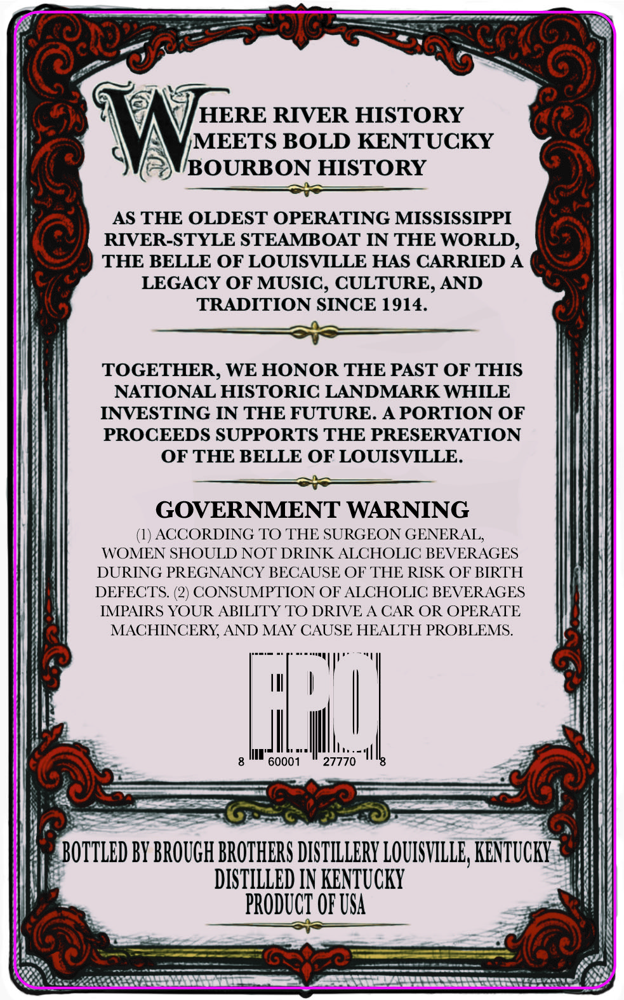
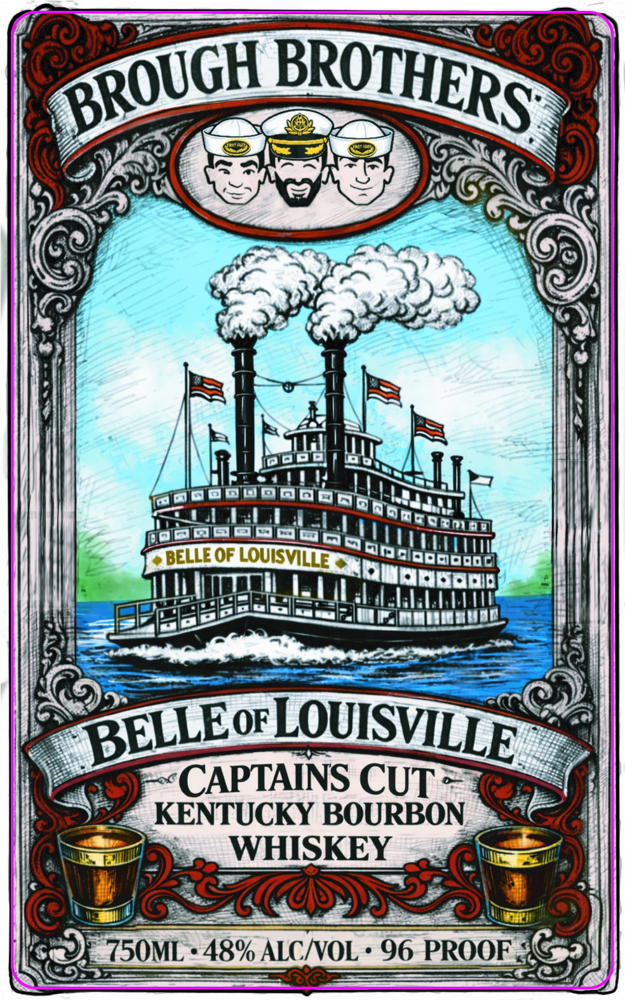

# TTB COLA Label Images - TTBID 26082001000207

**Brand Name:** BROUGH BROTHERS DISTILLERY

**Fanciful Name:** BELLE OF LOUISVILLE CAPTAIN'S CUT

**Issue Date:** 03/23/2026

**Origin Code:** 22

**Product Class/Type:** 141

**Source:** [TTB Public COLA Registry](https://ttbonline.gov/colasonline/viewColaDetails.do?action=publicFormDisplay&ttbid=26082001000207)

## Label Images

### Back Label

### Front Label

## Extracted Label Text

*Text extracted via OCR - may contain errors*

**Detected Proof:** 96

### Back Label

HERE RIVER HISTORY
MEETS BOLD KENTUUCKY
BOURBON HISTORY
AS THE OLDEST OPERATING MISSISSIPPI
RIVER-STYLE STEAMBOAT IN THE WORLD,
THE BELLE OF LOUISVILLE HAS CARRIED A
LEGACY OF MUSIC , CULTURE, AND
TRADITION SINCE 1914.
TOGETHER, WE HONOR THE PAST OF THIS
NATIONAL HISTORIC LANDMARK WHILE
INVESTING IN THE FUTURE. A PORTION OF
PROCEEDS SUPPORTS THE PRESERVATION
OF THE BELLE OF LOUISVILLE.
GOVERNMENT WARNING
ACCORDING TO THE SURGEON GENERAL
WOMEN SHOULD NOT DRINK ALCHOLIC BEVERAGES
DURING PREGNANCY BECAUSE OF THE RISK OF BIRTH
DEFECTS: (2) CONSUMPTION OF ALCHOLIC BEVERAGES
IMPAIRS YOUR ABILITY TO DRIVE A CAR OR OPERATE
MACHINCERY AND MAY CAUSE HEALTH PROBLEMS.
4
60001
27770
BOTTLED BY BROUGH BROTHERS DISTILLERY LOUISVILLE; KENZUCKY
DISTILLED IN KENTUCKY
PRODUCT OF USA

### Front Label

DEQDOF LOUISVI
CAPTAINS CUT
KENTUCKY BOURBON
WHISKEY
750ML
48% ALCNOL
96 PROOF
BROTHERS
BROUGH
LOUISVILLE
BELLEOF
