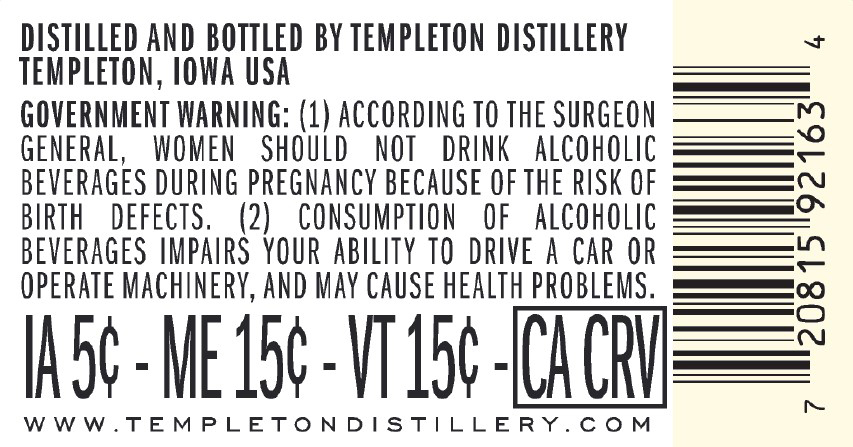
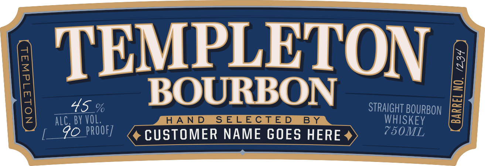
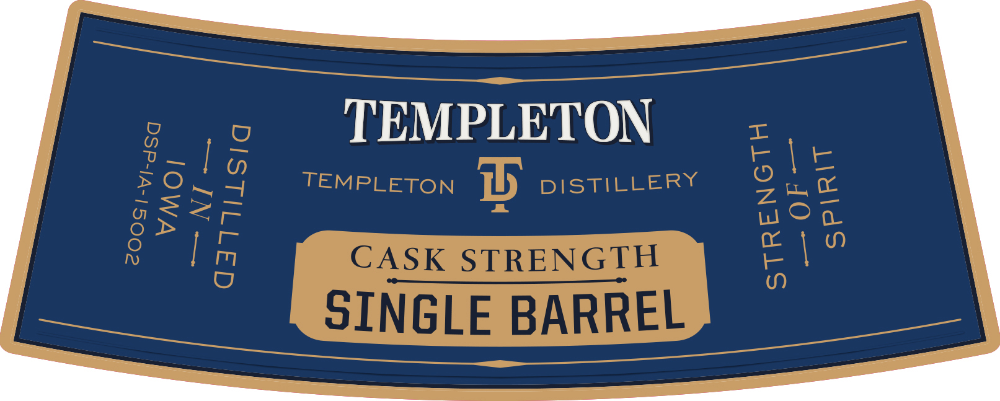

# TTB COLA Label Images - TTBID 26082001000314

**Brand Name:** TEMPLETON

**Issue Date:** 03/24/2026

**Origin Code:** 20

**Product Class/Type:** 101

**Source:** [TTB Public COLA Registry](https://ttbonline.gov/colasonline/viewColaDetails.do?action=publicFormDisplay&ttbid=26082001000314)

## Label Images

### Back Label

### Label 1

### Label 3

## Extracted Label Text

*Text extracted via OCR - may contain errors*

**Detected Proof:** 90

### Back Label

DISTILLED AND BOTTLED BY TEMPLETON  DISTILLERY
TEMPLETON, IOWA USA
GOVERNMENT WARNING: (1) ACCORDING TO THE SURGEON
GENERAL,
WOMEN
ShOuLd
NOT
DRINK   alcoholic
2
bEveRAGes DURING pregnancy BECAUSE €F thE RISK OF
BIRTH
DeFECTS,
(2)
CONSUMPTION
OF
alcohOlic
beveRAGeS IMPAIRS YOUR ablLITY TO  DRIVE A CAR OR
operate Machinery, AND May CauSe health pROBLEMS.
Iasc-ME I5c- VT 154-DICHU
W W W.TEMPLEToND IStillERY
C 0 M

### Label 1

TEMPLETON
3
0
45_%
BOURBON
STRAIGHT BOURBON
1
alc; BY VOL;
HAND
SELECTED
B Y
WHISKEY
CA
90 PROOF]
CUSTOMER NAME GOES HERE
750ML

### Label 3

TEMPLETON
TEMPLETON
3
DISTILLERY
2
CASK STRENGTH
SINGLE BARREL
1
L
1
3
6
3
