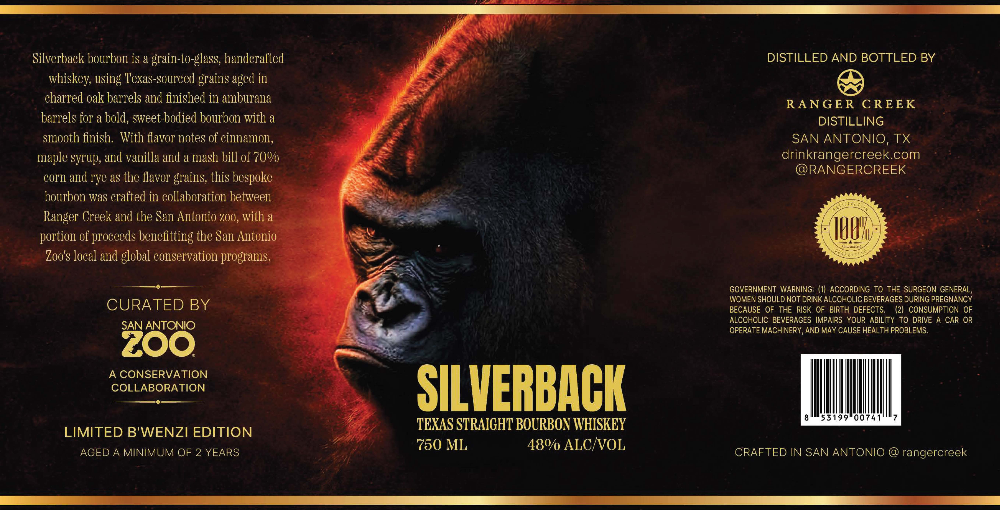

# TTB COLA Label Images - TTBID 26082001000414

**Brand Name:** SILVERBACK

**Issue Date:** 03/26/2026

**Origin Code:** 44

**Product Class/Type:** 101

**Source:** [TTB Public COLA Registry](https://ttbonline.gov/colasonline/viewColaDetails.do?action=publicFormDisplay&ttbid=26082001000414)

## Label Images

### Label 1

## Extracted Label Text

*Text extracted via OCR - may contain errors*

**Detected Age:** 2 Years

### Label 1

Silverback bourbon is a
to-glass; handcrafted
DISTILLED AND BOTTLED BY
whiskey; using Texas-sourced grains aged in
charred oak barrels and finished in amburana
RANGER
CREEK
barrels for a bold, sweet-bodied bourbon with a
DISTILLING
smooth finish   With favor notes of cinnamon,
SAN ANTONIO, TX
maple syrup, and vanilla and a mash bill of 70%
drinkrangercreek.com
@RANGERCREEK
corn and rye as the flavor grains, this bespoke
bourbon was crafted in collaboration between
Ranger Creek and the San Antonio z00, with a
portion of proceeds benefitting the San Antonio
IHOH
Gicurunlittt
Zoo s local and global conservation programs:
GOVERNMENT WARNING: (1) ACCORDING TO THE SURGEON GENERAL;
WOMEN SHOULD NOT DRINK ALCOHOLIC BEVERAGES DURING PREGNANCY
CURA TED BY
BECAUSE OF THE RISK OF BIRTH DEFECTS.
(2) CONSUMPTION OF
ALCOHOLIC BEVERAGES IMPAIRS YOUR ABILITY TO DRIVE A CAR OR
SAN ANTONIO
OPERATE MACHINERY AND MAY CAUSE HEALTH PROBLEMS.
ZOO
A CONSERVATION
cOLLABORATION
SILVERBACK
53199"00741
TEXAS STRAIGHT BOURBON WHISKEY
LIMITED B'WENZI EDITION
750 ML
480 ALC/VOL
AGED A MINIMUM OF 2 YEARS
CRAFTED IN SAN ANTONIO
rangercreek
grain-
