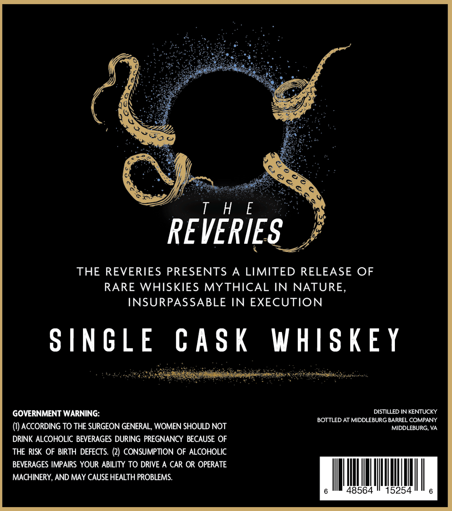
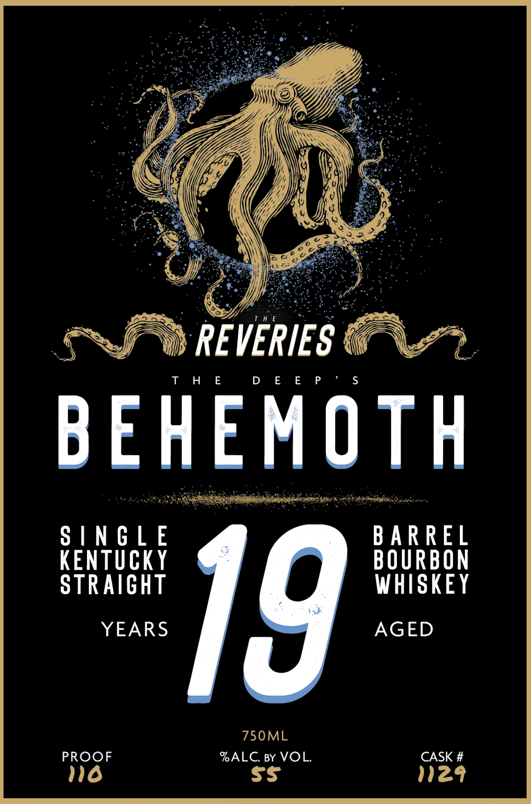

# TTB COLA Label Images - TTBID 26082001000473

**Brand Name:** MIDDLEBURG BARREL COMPANY

**Fanciful Name:** BEHEMOTH

**Issue Date:** 03/24/2026

**Origin Code:** 05

**Product Class/Type:** 101

**Source:** [TTB Public COLA Registry](https://ttbonline.gov/colasonline/viewColaDetails.do?action=publicFormDisplay&ttbid=26082001000473)

## Label Images

### Back Label

### Label 1

## Extracted Label Text

*Text extracted via OCR - may contain errors*

### Back Label

REVERIES. J

THE REVERIES PRESENTS A LIMITED RELEASE OF
RARE WHISKIES MYTHICAL IN NATURE,
INSURPASSABLE IN EXECUTION

SINGLE CASK WHISKEY

GOVERNMENT WARNING:

(1) ACCORDING TO THE SURGEON GENERAL, WOMEN SHOULD NOT
DRINK ALCOHOLIC BEVERAGES DURING PREGNANCY BECAUSE OF
THE RISK OF BIRTH DEFECTS. (2) CONSUMPTION OF ALCOHOLIC
BEVERAGES IMPAIRS YOUR ABILITY TO DRIVE A CAR OR OPERATE
MACHINERY, AND MAY CAUSE HEALTH PROBLEMS.

DISTILLED IN KENTUCKY
BOTTLED AT MIDDLEBURG BARREL COMPANY
MIDDLEBURG, VA.

AIT

48564

### Label 1

Y

Y

es

((

WS

Vf

Hie |

if

Se

eF- REVERIES 7

THE

D E E P

BEHEMOTH

Rede

Ronen

SINGLE

BARREL

BOURBON

KENTUCKY

STRAIGHT

WHISKEY

YEARS

AGED

19

750ML

PROOF

NO

ALC. BY VOL.

N29

CASK #
