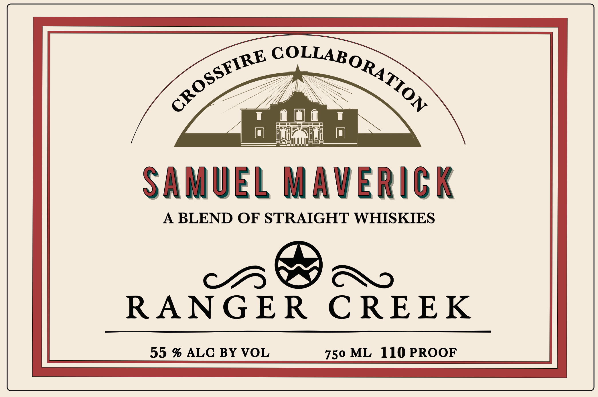
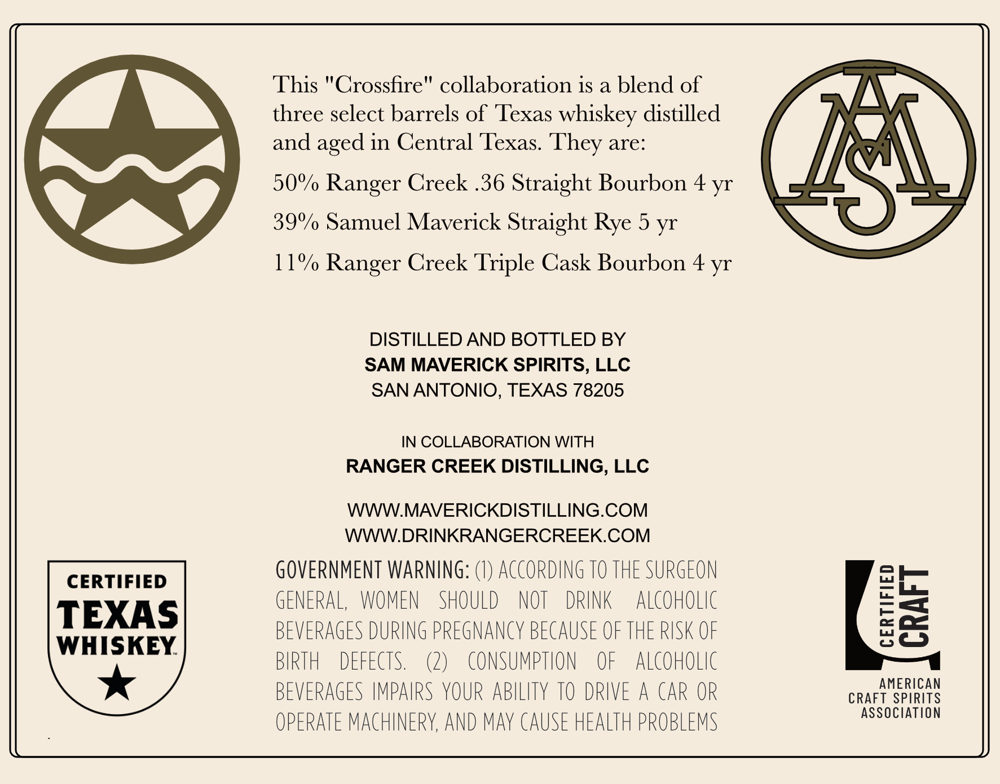

# TTB COLA Label Images - TTBID 26082001000508

**Brand Name:** SAMUEL MAVERICK

**Fanciful Name:** RANGER CREEK

**Issue Date:** 03/27/2026

**Origin Code:** 44

**Product Class/Type:** 129

**Source:** [TTB Public COLA Registry](https://ttbonline.gov/colasonline/viewColaDetails.do?action=publicFormDisplay&ttbid=26082001000508)

## Label Images

### Front Label

### Label 2

## Extracted Label Text

*Text extracted via OCR - may contain errors*

**Detected Age:** 4 Years

### Front Label

gsnE COLLARG

Zeta
1 i@i 1
m_ RST
SAMUEL MAVERICK
A BLEND OF STRAIGHT WHISKIES
CHD B® CXYo
RANGER CREEK
_ ROMER ape Ome _

### Label 2

This "Crossfire" collaboration is a blend of
three select barrels of Texas whiskey distilled
and
in Central Texas.
are:
50% Ranger Creek .36 Straight Bourbon 4 yr
ISL
39%/ Samuel Maverick Straight
5 yr
11%/ Ranger Creek Triple Cask Bourbon 4 yr
DISTILLED AND BOTTLED BY
SAM MAVERICK SPIRITS, LLC
SAN ANTONIO, TEXAS 78205
IN COLLABORATION WITH
RANGER CREEK DISTILLING, LLC
WWWMAVERICKDISTILLING.COM
WWWDRINKRANGERCREEK.COM
GOVERNMENT WARNING:
ACCORDING TO THE SURGEON
CERTIFIED
TEXAS
GENERAL,
WOMEN
SHOULD
NOT
DRINK
ALCoHOLIc
87
BEVERAGES DURING PREGNAncY BECAUSE OF THE RISK OF
WHISKEY
BIRTH
DEFECTS
(2)
consumption
OF
AlCoHoLIC
BEVERAGES IMPAIRS YOUR ABILITY TO DRIVE
A CAR OR
CRAFT MERCAS
ASSOCiATion
OPERATE MACHINERY, AND may CAUSE HEALTH PROBLEMS
They
aged
Rye
