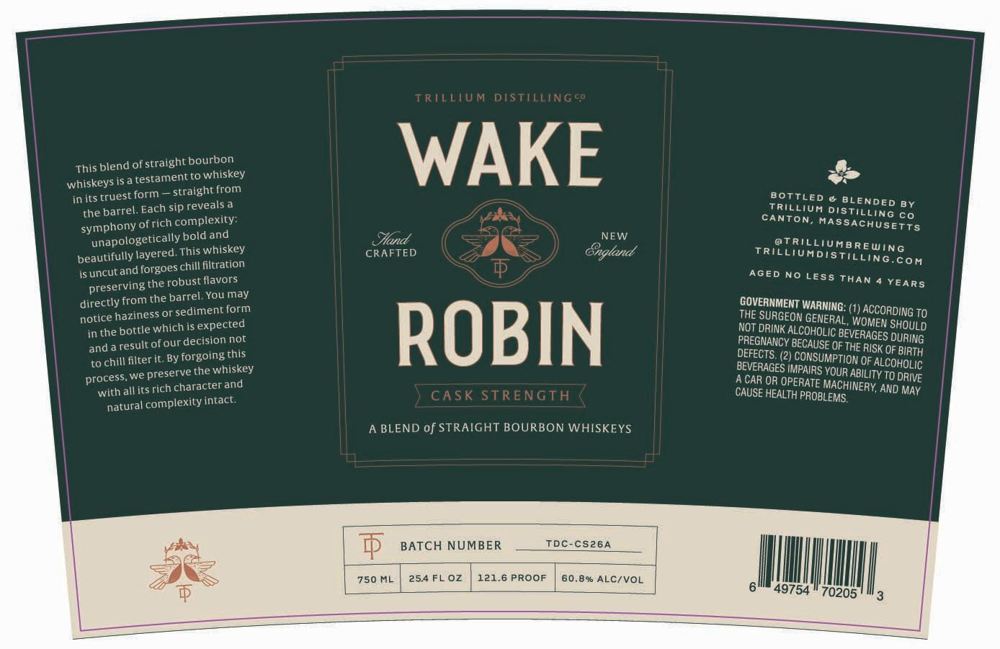

# TTB COLA Label Images - TTBID 26082001000546

**Brand Name:** TRILLIUM DISTILLING CO

**Issue Date:** 03/27/2026

**Origin Code:** 26

**Product Class/Type:** 121

**Source:** [TTB Public COLA Registry](https://ttbonline.gov/colasonline/viewColaDetails.do?action=publicFormDisplay&ttbid=26082001000546)

## Label Images

### Label 1

## Extracted Label Text

*Text extracted via OCR - may contain errors*

**Detected Proof:** 121.6

### Label 1

TRILLIUM DISTIILINGco
This blend of straight bourbon
WAKE
whiskeys is a
testamentto whiskey
in its truest form
straight from
BOTTLED
BLENDED
the barrel. Each sip reveals a
Trillium distilling
BY
ofrich complexity:
CANTON;
MASSACHUSETTS
co
unapologetically bold and
NFW
beautifully layered This whiskey
CRAFTED
Sogland
TriltnuhdistareWg"e
filtration
coM
is uncut and forgoes
AGED No LESS THAN
preservingthe robust flavors
YEARS
directly from the barrel. You may
GOVERNMENT WARNING:
notice haziness or sediment form
THE
SURGEON GENERAL ,
ACCORDING TO
in the bottle
expected
ROBIN
Paeghancy s coeoer BeveQNgES DUubug
and
ofour decision not
DEFECANCy BEgAUSE Ofthe RiSesPUrRTG
chill filter iL: By forgoing this
DEFECTS: (2)
ionsumption Of ALCOHOltc
we
the whiskey
BEVERAGES DEPAIRS YOUR ABILITY TO
process
character and
ACAR OR OPERATE MACHINERY
with all its
CA SK STRENGTH
CAUSE HEALTH PROBLEMS,
AND MAY
natural complexity intact:
A BLEND of STRAIGHT BOURBON WHISKEYS
BATCH NUMBER
TdC-CS26A
750 ML
254 FL 0z
121.6 PROOF
60.8% ALC/VOL
'49754
70205
symphony
chill
SHOULD
which _
resull e
preserve =
DRIVE
rich
