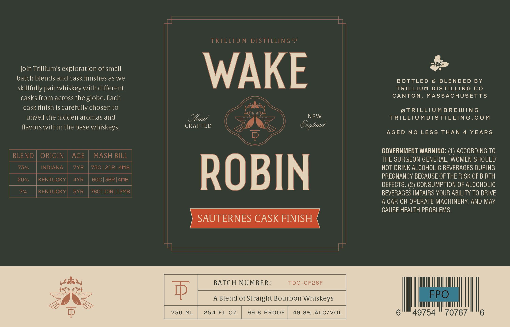

# TTB COLA Label Images - TTBID 26082001000552

**Brand Name:** TRILLIUM DISTILLING CO

**Issue Date:** 03/24/2026

**Origin Code:** 26

**Product Class/Type:** 121

**Source:** [TTB Public COLA Registry](https://ttbonline.gov/colasonline/viewColaDetails.do?action=publicFormDisplay&ttbid=26082001000552)

## Label Images

### Label 1

## Extracted Label Text

*Text extracted via OCR - may contain errors*

**Detected Proof:** 146
**Detected Age:** 4 Years

### Label 1

TRILLIUM DISTILLINGco
Join Trillium'$ exploration of small
WAKE
batch blends and cask finishes as we
BOTTLED
e
BLENDED
BY
skillfully pair whiskey with different
TRILLIUM
DISTILLING C0
casks from across the globe  Each
CANTON, MASSACHUSETTS
cask finish is carefully chosen to
@TRILLIUMBREWING
unveil the hidden aromas and
Sand
NEW
TRILLIUMDISTILLING.COM
flavors within the base whiskeys.
CRAFTED
Sngland
AGED
NO
LESS THAN 4 YEARS
GOVERNMENT WARNING: (1) ACCORDING TO
BLEND
ORIGIN
AGE
MASH BILL
THE SURGEON GENERAL, WOMEN SHOULD
73%
INDIANA
7YR
75C | 21R | 4MB
NOT DRINK ALCOHOLIC BEVERAGES DURING
20%
KENTUCKY
4YR
60C | 36R|4MB
ROBIN
PREGNANCY BECAUSE OF THE RISK OF BIRTH
DEFECTS: (2) CONSUMPTION OF ALCOHOLIC
7%
KENTUCKY
SYR
78C | 1OR | 12MB
BEVERAGES IMPAIRS YOUR ABILITY TO DRIVE
A CAR OR OPERATE MACHINERY, AND MAY
CAUSE HEALTH PROBLEMS.
SAUTERNES CASK FINISH
BATCH NUMBER:
TDC-CF26F
p
A Blend of Straight Bourbon Whiskeys
FPO
750
ML
25.44 FL OZ
99.6
PROOF
49.8 %
ALC/VOL
49754
70767
