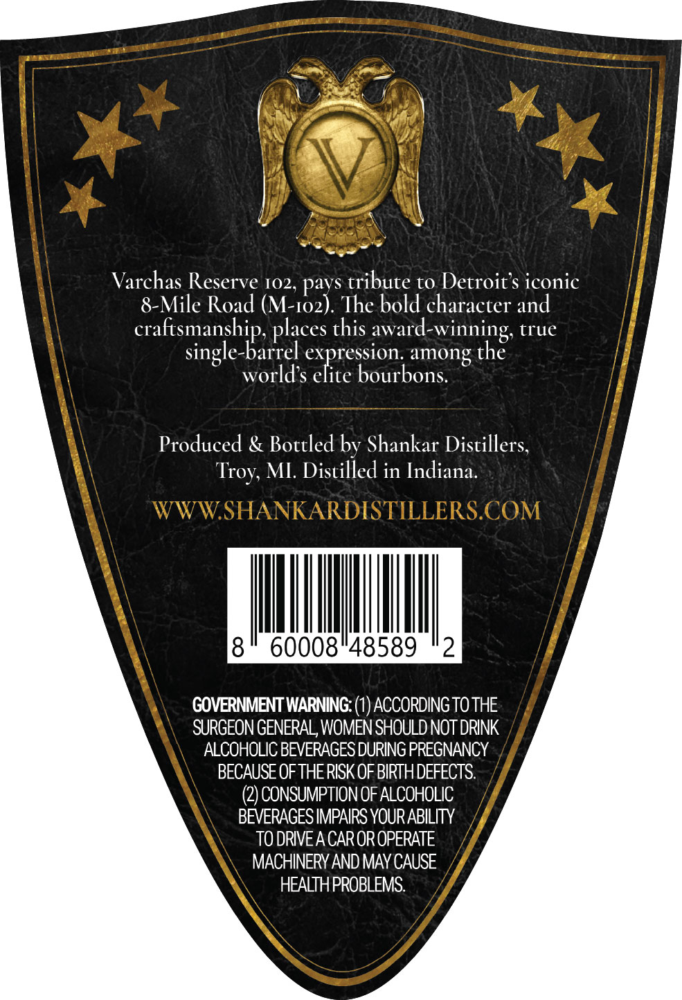
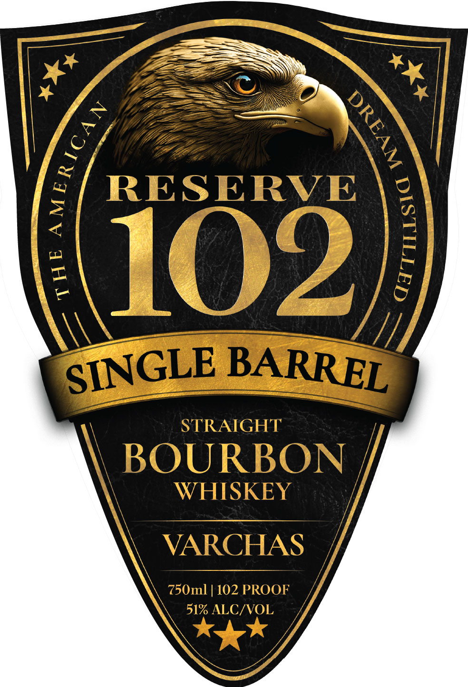

# TTB COLA Label Images - TTBID 26082001000567

**Brand Name:** VARCHAS

**Fanciful Name:** RESERVE 102

**Issue Date:** 03/24/2026

**Origin Code:** 06

**Product Class/Type:** 101

**Source:** [TTB Public COLA Registry](https://ttbonline.gov/colasonline/viewColaDetails.do?action=publicFormDisplay&ttbid=26082001000567)

## Label Images

### Back Label

### Front Label

## Extracted Label Text

*Text extracted via OCR - may contain errors*

**Detected Proof:** 102

### Back Label

Varchas Reserve 102, pays tribute to Detroit's iconic
8-Mile Road (M-102). The bold character and
craftsmanship, places this award-winning, true
single-barrel expression. among the
world’s elite bourbons.

Produced & Bottled by Shankar Distillers,
Troy, MI. Distilled in Indiana.

8" 60008°48589 *2

GOVERNMENT WARNING: (1) ACCORDING TO THE
SURGEON GENERAL, WOMEN SHOULD NOT DRINK
ALCOHOLIC BEVERAGES DURING PREGNANCY

BECAUSE OF THE RISK OF BIRTH DEFECTS.

(2) CONSUMPTION OF ALCOHOLIC
BEVERAGES IMPAIRS YOUR ABILITY _,
TO DRIVE ACAR OR OPERATE
MACHINERY AND MAY CAUSE
HEALTH PROBLEMS.

### Front Label

RESERVE
1621
STRAIGHT
BOURBON
WHISKEY
VARCHAS
750ml
102 PROOF
51% ALC/VOL
1
1

SINGLE
BARREL
