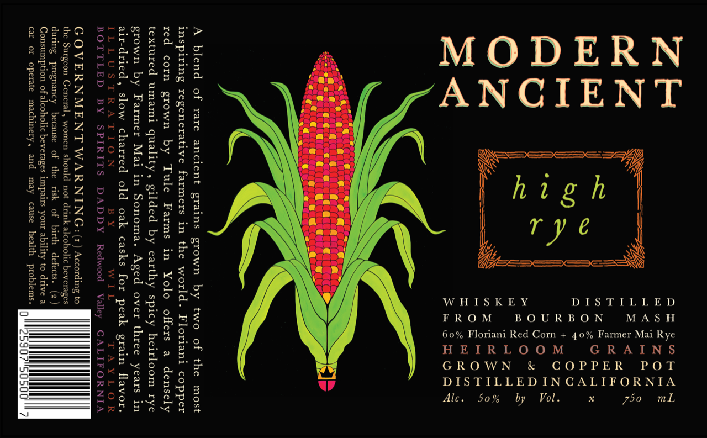

# TTB COLA Label Images - TTBID 26082001000612

**Brand Name:** MODERN ANCIENT

**Issue Date:** 03/24/2026

**Origin Code:** 01

**Product Class/Type:** 140

**Source:** [TTB Public COLA Registry](https://ttbonline.gov/colasonline/viewColaDetails.do?action=publicFormDisplay&ttbid=26082001000612)

## Label Images

### Label 1

## Extracted Label Text

*Text extracted via OCR - may contain errors*

**Detected Proof:** 100

### Label 1

MASH

GRAINS

GROWN & COPPER POT

DISTILLED
DISTILLEDINCALIFORNIA
x

BOURBON
Vol.

Floriani Red Corn + 40% Farmer Mai Rye

by

50%

WHISKEY
FROM
HEIRLOOM

Alc.

60%

A blend of rare ancient grains grown by two of the most
inspiring regenerative farmers in the world. Floriani copper
red corn grown by Tule Farms in Yolo offers a densely
textured umami quality, gilded by earthy spicy heirloom rye
grown by Farmer Mai in Sonoma. Aged over three years in

air-dried, slow charred old oak casks for peak grain flavor.
ILLUSTRATION BY Wit
BOTTLED BY SPIRITS D DY Valley CA

GOVERNMENT WARNING

the Surgeon General, women should not drink alc
during pregnancy because of the risk of birth defects. (2)
Consumption of alcoholic beverages impairs your ability to drive a
