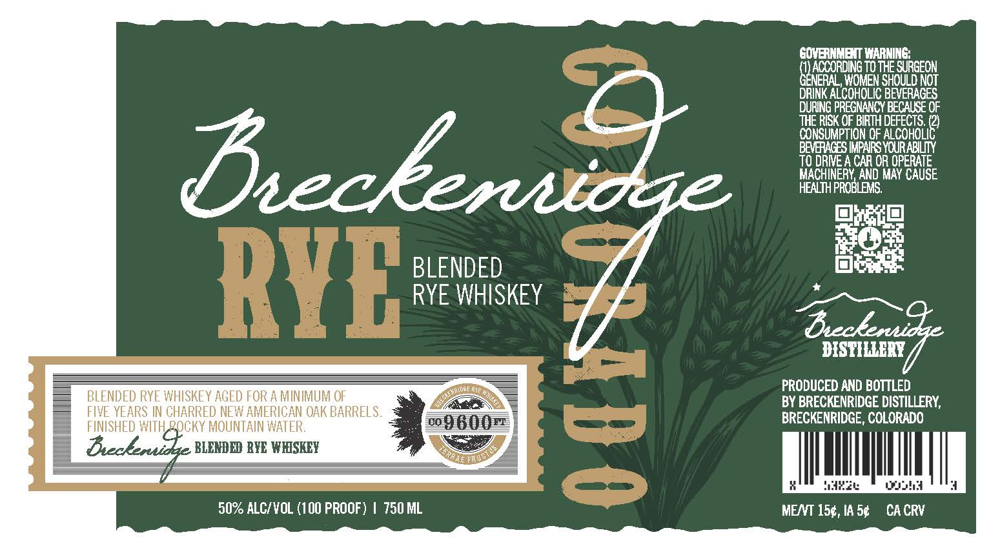

# TTB COLA Label Images - TTBID 26082001000823

**Brand Name:** BRECKENRIDGE

**Issue Date:** 03/31/2026

**Origin Code:** 13

**Product Class/Type:** 132

**Source:** [TTB Public COLA Registry](https://ttbonline.gov/colasonline/viewColaDetails.do?action=publicFormDisplay&ttbid=26082001000823)

## Label Images

### Label 1

## Extracted Label Text

*Text extracted via OCR - may contain errors*

**Detected Proof:** 100

### Label 1

GOVERNNEMT WARNING;
ACCORDING TO THE SURGEON
Hheroa
WOMEN SHOULD NOT
DRINK ALCOHOLIC BEVERAGES
DURING PREGNANCY BECAUSE OF
THE RISK OF BIRTH DEFECTS
CONSUMPTION OF
DEcecouE
BEVEACES IMPAIFS YOURARILIY
TO DRIE A CAR OR OPERATE
Eeckenioge
HecthpFrbLeNB May CausE
BLENDED
RYE
RYE WHISKEY
Bcbenidg
DISTILERY
BLENDED RYE WHISKEY AGED FOR A MINIMUM OF
2
BRODUCEDNRDBCDTGERLERY
FIVE YEARS IN CHARRED NEW AMERICAN OAK BARRELS .
BRECKENRIDGE, COLORADO
FINISHED WITH B@Cky MOUNTAIN WATER:
0o98
Bwckeruic
BLBNDBD RYE WESKEY
"14
Ouu
50% ALCIVOL (100 PROOF)
750 ML
MENT 154 , IA 54
CA CRV
