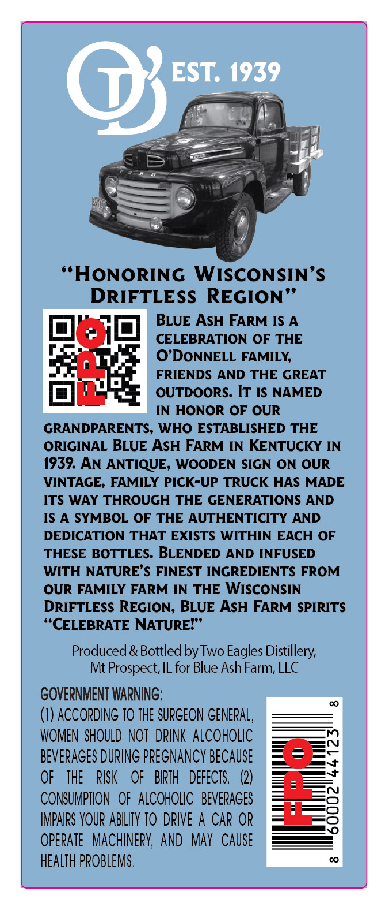
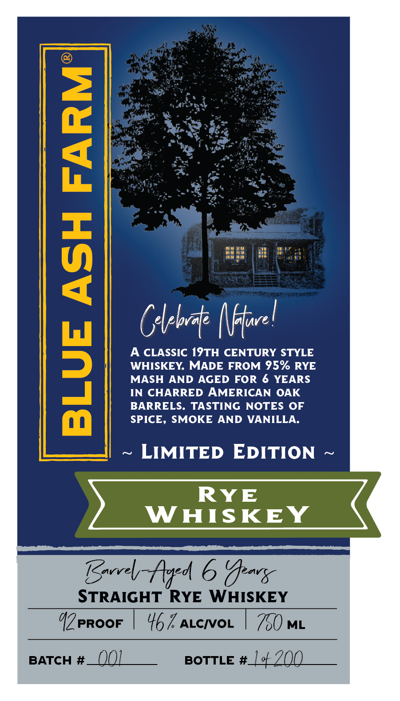

# TTB COLA Label Images - TTBID 26082001000831

**Brand Name:** BLUE ASH FARM

**Issue Date:** 03/31/2026

**Origin Code:** 04

**Product Class/Type:** 102

**Source:** [TTB Public COLA Registry](https://ttbonline.gov/colasonline/viewColaDetails.do?action=publicFormDisplay&ttbid=26082001000831)

## Label Images

### Back Label

### Label 1

## Extracted Label Text

*Text extracted via OCR - may contain errors*

**Detected Age:** 6 Years

### Back Label

EST; 1939
HONORING WISCONSIN'$
DRIFTLESS REGION
BLUE ASH FARM IS A
CELEBRATION OF THE
O'DONNELL FAMILY;
FRIENDS
AND THE GREAT
OUTDOORS. IT IS NAMED
IN HONOR OF OUR
GRANDPARENTS, WHO ESTABLISHED THE
ORIGINAL BLUE ASH FARM
IN
KENTUCKY IN
1939. AN ANTIQUE; WOODEN SIGN ON OUR
VINTAGE, FAMILY PICK-UP TRUCK HAS MADE
ITS WAY THROUGH THE GENERATIONS AND
IS
A SYMBOL OF THE AUTHENTICITY
AND
DEDICATION THAT EXISTS WITHIN EACH OF
THESE BOTTLES. BLENDED
AND INFUSED
WITH NATURE' $ FINEST INGREDIENTS FROM
OUR FAMILY
FARM IN THE
WISCONSIN
DRIFTLESS REGION, BLUE ASH FARM SPIRITS
"CELEBRATE NATURE?"
Produced & Bottled by Two Eagles Distillery;
Mt Prospect; IL for Blue Ash Farm; LLC
GOVERNMENT WARNING;
(I) ACCORDING TO THE SURGEON GENERAL ,
WOMEN  SHOULD NOT   DRINK ALCOHOLIC
BeVERAGES DURING PREGNANCY BECAUSE
OF
THE
RISK
OF
BIRTH
DEFECTS,   (2)
0
CONSUMPTION   OF aLcOHOLIC   BEVERAGES
IMPAIRS YOUR ABILITY TO DRIVE A CAR OR
opeRATe   MACHINERK; AND   May  CAUSe
HEALTH PPOBLEMS ,

### Label 1

1
9
Gbbdt |ffel
A CLASSIC 19TH CENTURY STYLE
WHISKEY MADE FROM 95% RYE
3
MASH
AND AGED
FOR 6
YEARS
IN CHARRED AMERICAN
OAK
BARRELS.
TASTING NOTES OF
SPICE, SMOKE AND
VANILLA.
LIMITED EDITION
RYE
WHISKEY
Eovrh Aded 6 'Teavx
STRAIGHT RYE
WHISKEY
PROOF
467 ALcIvOL
750 ML
BATCH #
QQL
BOTTLE
#44200
