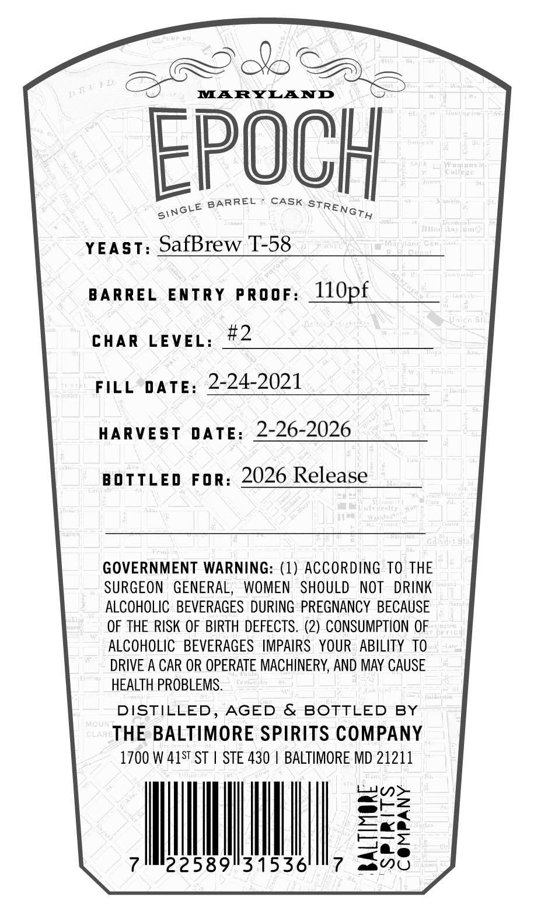
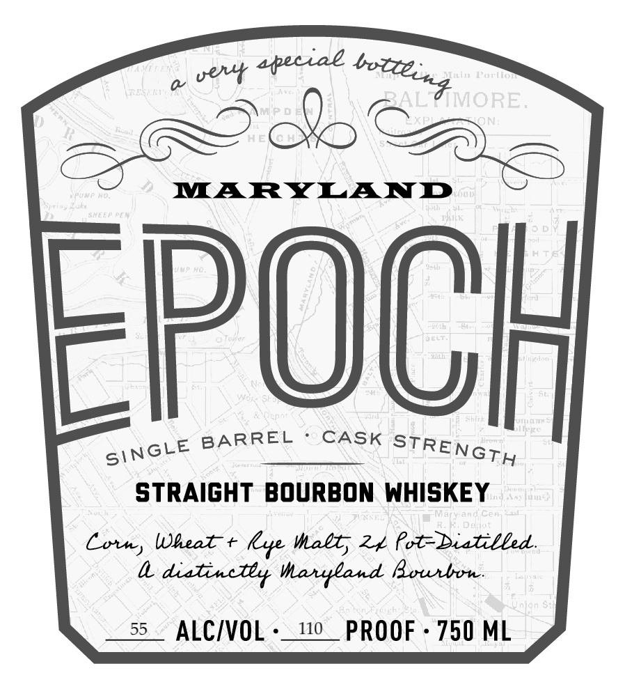

# TTB COLA Label Images - TTBID 26082001000855

**Brand Name:** EPOCH

**Issue Date:** 03/24/2026

**Origin Code:** 25

**Product Class/Type:** 101

**Source:** [TTB Public COLA Registry](https://ttbonline.gov/colasonline/viewColaDetails.do?action=publicFormDisplay&ttbid=26082001000855)

## Label Images

### Back Label

### Front Label

### Label 3

## Extracted Label Text

*Text extracted via OCR - may contain errors*

*1 image(s) excluded: text did not meet readability threshold*

**Detected Proof:** 110

### Back Label

ats

EPOCH

ginct® alae era all

YEAST: SafBrew T-58

BARREL ENTRY PRooF: 110pf

CHAR LEVEL #2

FILL DATE: 2-24-2021

HARVEST DATE: 2-26-2026

BOTTLED For: 2026 Release

GOVERNMENT WARNING: (1) ACCORDING TO THE

SURGEON GENERAL, WOMEN SHOULD NOT DRINK

ALCOHOLIC BEVERAGES DURING PREGNANCY BECAUSE

OF THE RISK OF BIRTH DEFECTS. (2) CONSUMPTION OF

ALCOHOLIC BEVERAGES IMPAIRS YOUR ABILITY TO

DRIVE A CAR OR OPERATE MACHINERY, AND MAY CAUSE

HEALTH PROBLEMS.

DISTILLED, AGED & BOTTLED BY

THE BALTIMORE SPIRITS COMPANY

1700 W 415" ST | STE 430 | BALTIMORE MD 21211

Lan>

awt2z

cea

Rez

=

2589531536

aa O

### Front Label

veyt
apeciae
ain Fo(n
RAL
ON
MARYLAND
FpOch
BARREL
CASK
strAIGHT BourBOn WHISKEY
7n (
Ce#
Deut
Lotn)
Wneat +
Wabt; 21 Pot-Biatilled.
dialincley Manyland Bounbon
nfon
55
ALCIVOL
110
PROOF
750 ML
botleint MORE.
STRENGTH
SiNGLE
lx
