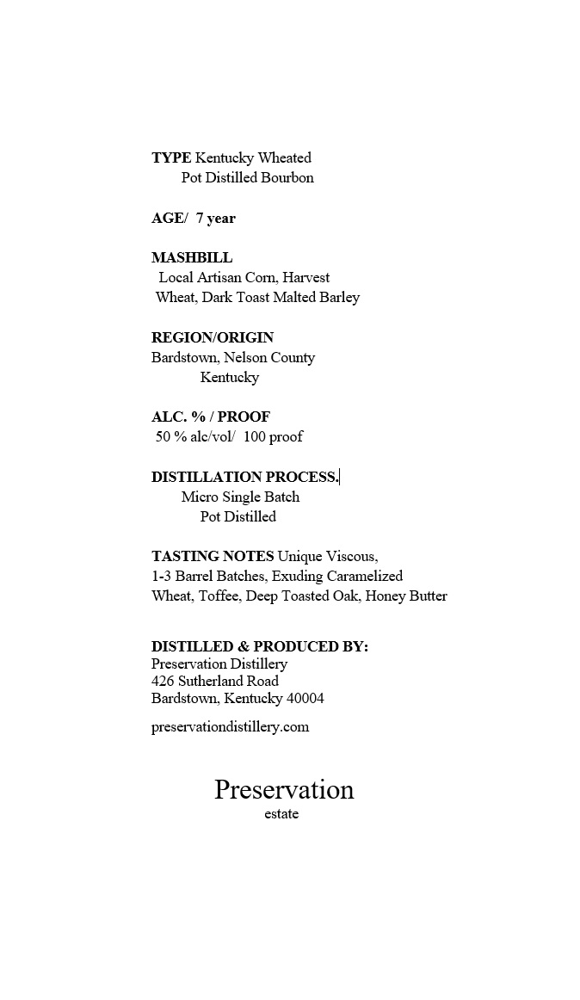

# TTB COLA Label Images - TTBID 26082001000939

**Brand Name:** PRESERVATION

**Issue Date:** 03/24/2026

**Origin Code:** 22

**Product Class/Type:** 141

**Source:** [TTB Public COLA Registry](https://ttbonline.gov/colasonline/viewColaDetails.do?action=publicFormDisplay&ttbid=26082001000939)

## Label Images

### Label 1

### Label 2

### Label 3

### Label 4

## Extracted Label Text

*Text extracted via OCR - may contain errors*

**Detected Proof:** 100

### Label 1

TYPE Kentucky Wheated
Pot Distilled Bourbon
AGEI
year
MASHBILL
Local Artisan Comn. Haivest
Wheat; Dark Toast Malted Barley
REGIONIORIGIN
Bardstown; Nelson County
Kentucky
ALC
PROOF
50 % alc voll  100 proof
DISTILLATION PROCESS |
Micro Single Batch
Pot Distilled
TASTING NOTES Unique Viscous
1-3 Bairel Batches.
Exuding Caramelized
Wheat; Toffee; Deep Toasted Oak; Honey Butter
DISTILLED & PRODUCED BY:
Preservation Distillery
426 Sutherland Road
Bardstown; Kentucky 40004
preseivationdistillery.com
Preservation
estate

### Label 2

GOVERNMENT WARNING:
ACCORDING
TO
THE
SURGEON
GENERAL
INGmEr) AGOBD8
NOT
DRINK
AicoHoLic
BEVERAGES
DURiNG
PREGNANCY
BECAUSE
OF
THE
RISK
OF
BIRTH
DEFFECTS
2
CONSUMpTION
OF
Alcohoic
BEVERAGES
IMPAIRS
YOUR
ABILITY
TO
DRIVE
A
CAR
OR
OPERATE
MACHINERY
And
MAY
CAUSE
UPC - FOR POSITION ONLY
HeALTH
PROBLEMS:
750ml

### Label 3

Barrel Number:

Private Barrel Pick for:

1234

A.B.C. Wine & Spirits

### Label 4

PRESERVATION

estate pot distilled

Kentucky Bourbon Whiskey
