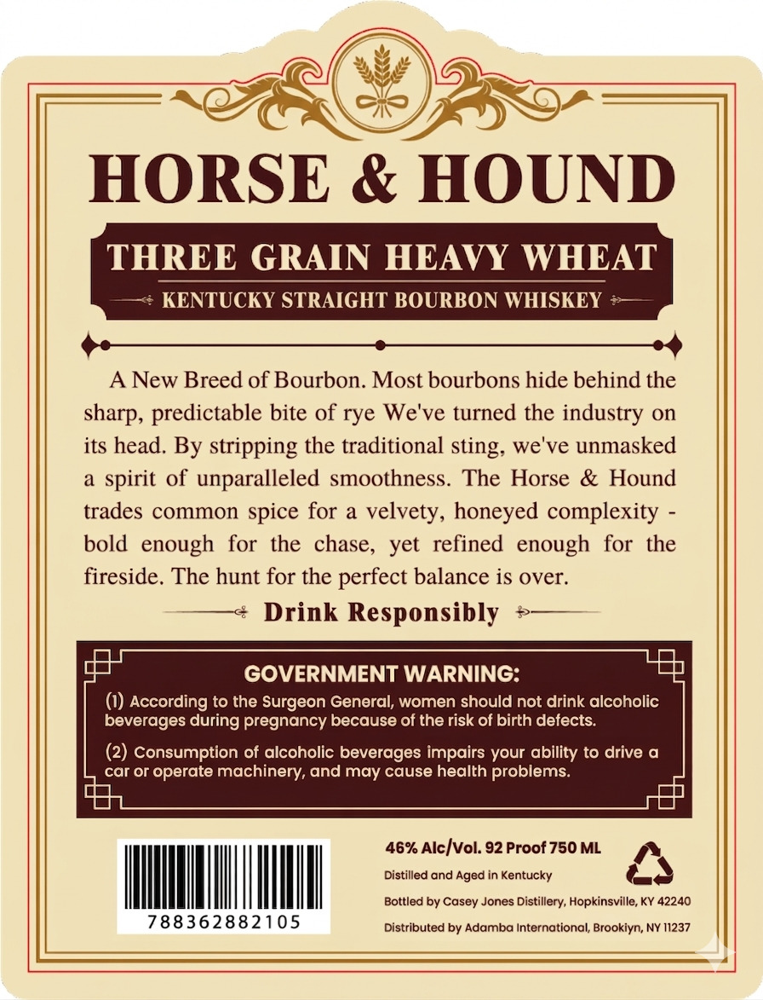
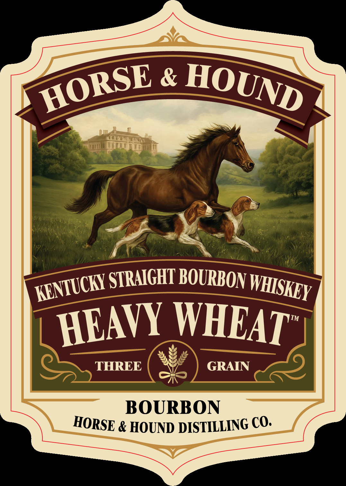

# TTB COLA Label Images - TTBID 26082001000975

**Brand Name:** HORSE AND HOUND

**Issue Date:** 04/06/2026

**Origin Code:** 22

**Product Class/Type:** 101

**Source:** [TTB Public COLA Registry](https://ttbonline.gov/colasonline/viewColaDetails.do?action=publicFormDisplay&ttbid=26082001000975)

## Label Images

### Back Label

### Front Label

## Extracted Label Text

*Text extracted via OCR - may contain errors*

**Detected Proof:** 92

### Back Label

HORSE & HOUND
THREE GRAIN HEAVY WHEAT
KENTUCKY STRAIGHT BOURBON WHISKEY
A New Breed of Bourbon. Most bourbons hide behind the
sharp, predictable bite of rye We've turned the industry on
its head. By stripping the traditional sting; we've unmasked
of
unparalleled smoothness  The Horse
& Hound
trades common spice for a velvety, honeyed complexity
bold   enough
the   chase,
yet  refined  enough   for
the
fireside. The hunt for the perfect balance is over:
Drink Responsibly
GOVERNMENT WARNING:
According to the Surgeon General; women should not drink alcoholic
beverages during pregnancy because of the risk of birth defects:
(2) consumption of alcoholic beverages impairs your ability to drive a
car or operate machinery; and may cause health problems:
46% AlcIvol: 92 Proof 750 ML
Distilled and Aged in Kentucky
Bottled by Casey Jones Distillery, Hopkinsville, KY 42240
788362882105
Distributed by Adamba International, Brookiyn; NY 11237
spirit
for

### Front Label

&
STRAIGHT BOURBON
TM
WHLAT
THREE
GRAIN
BOURBON
& HOUND
DISTILLING CO.
HORSE
HOUND
KENTUCKY
WHISKEY
HEAVY
HORSE
