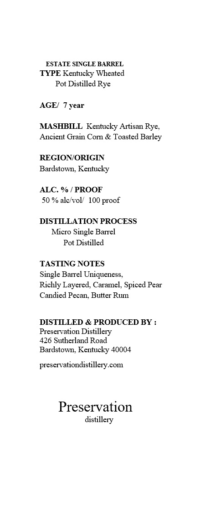

# TTB COLA Label Images - TTBID 26082001001004

**Brand Name:** PRESERVATION

**Issue Date:** 03/24/2026

**Origin Code:** 22

**Product Class/Type:** 142

**Source:** [TTB Public COLA Registry](https://ttbonline.gov/colasonline/viewColaDetails.do?action=publicFormDisplay&ttbid=26082001001004)

## Label Images

### Label 1

### Label 2

### Label 3

### Label 4

## Extracted Label Text

*Text extracted via OCR - may contain errors*

**Detected Proof:** 100

### Label 1

ESTATE SINGLE BARREL
TYPE Kentucky Wheated
Pot Distilled Rye
AGEI
year
MASHBILL Kentucky Artisan Rye;
Ancient Grain Corn & Toasted Barley
REGIONORIGIN
Bardstown, Kentucky
ALC. %
PROOF
50 % alc voll 100
DISTILLATION PROCESS
Micro Single Bairel
Pot Distilled
TASTING NOTES
Single Barrel Uniqueness;
Richly Layered, Caramel, Spiced Pear
Candied Pecan; Butter Rum
DISTILLED & PRODUCED BY
Preservation Distillery
426 Sutherland Road
Bardstown, Kentucky 40004
preseivationdistillery.com
Preservation
distillery
proof

### Label 2

Barrel Number:

Private Barrel Pick for:

1234

A.B.C. Wine & Spirits

### Label 3

GOVERNMENT WARNING:
ACCORDING
TO
THE
SURGEON
GENERAL
INGmEr) AGOBD8
NOT
DRINK
AicoHoLic
BEVERAGES
DURiNG
PREGNANCY
BECAUSE
OF
THE
RISK
OF
BIRTH
DEFFECTS
2
CONSUMpTION
OF
Alcohoic
BEVERAGES
IMPAIRS
YOUR
ABILITY
TO
DRIVE
A
CAR
OR
OPERATE
MACHINERY
And
MAY
CAUSE
UPC - FOR POSITION ONLY
HeALTH
PROBLEMS:
750ml

### Label 4

PRESERVATION

SINGLE BARREL

estate pot distilled

Kentucky Rye Whiskey
