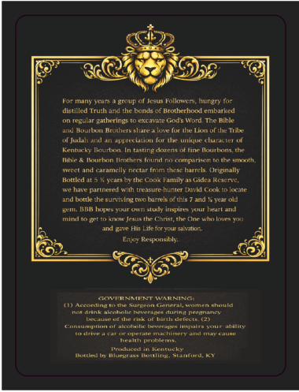
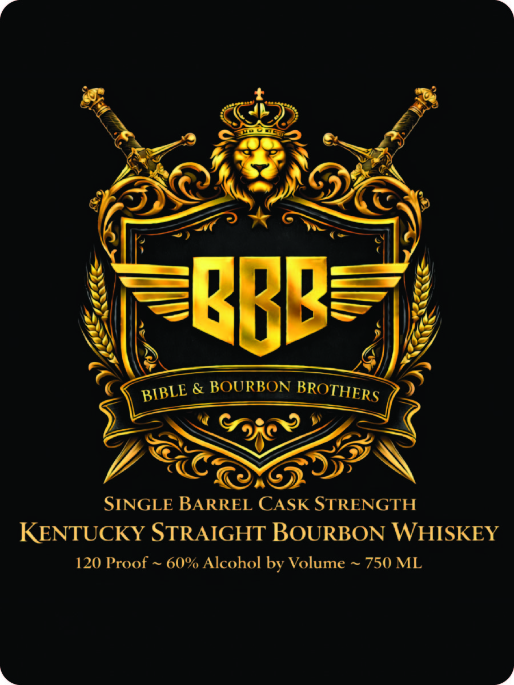

# TTB COLA Label Images - TTBID 26083001000180

**Brand Name:** BIBLE & BOURBON BROTHERS

**Issue Date:** 04/20/2026

**Origin Code:** 22

**Product Class/Type:** 101

**Source:** [TTB Public COLA Registry](https://ttbonline.gov/colasonline/viewColaDetails.do?action=publicFormDisplay&ttbid=26083001000180)

## Label Images

### Back Label

### Label 1

## Extracted Label Text

*Text extracted via OCR - may contain errors*

**Detected Proof:** 120

### Back Label

Forntan;
Cooui
Kcaua Follutcr
hurgry I0?
distilled Ttuth
the bonds
Hrotherhord Gnbarked
Icfuiar punctinz
exc vatc Godt Word, Thc pitk
smctflt_Ts
Halea een lntm
~pHee ialdutt
turxlet
Dourbon
stn
tine Mouthont
Wnmeninenate
COtamt
CatamicIir Trctar Itnm Inct? hattcis
Urleinall
Dottlcd
Loul Tainil
Gidca Rcicrc
antn
Kh tnaanhuicr Dauid CuED lacatr
Hanha
urvivingri tarele Mthlo
Ann en
BDB Inqes Yruf UwII study
Hccinen#nntne
inouct
anw JasungIit Chnsi Ine Onr Wi Icnvrt MulI
Ind Rc Hr Lleecra CuI E1caiot
L Keon-Ibly
dovernmentIVarNiwo
Arcenci
unten
Entl
Fmni Aas Aeafinad
durica Dapanang}
eIei
Teatnttetnanntnteelaltalie
anF
Hieana
Oeealcteenteenons
clced
iuttani
HELLeu
MLctas
ctutnineALmlrtu
Urdocmr

### Label 1

BRB
& BOURBON
SINGLE BARREL CASK STRENGTH
KENTUCKY STRAIGHT BOURBON WHISKEY
120 Proof
60% Alcohol by Volume
750 ML
BROTHERS
BIBLE
