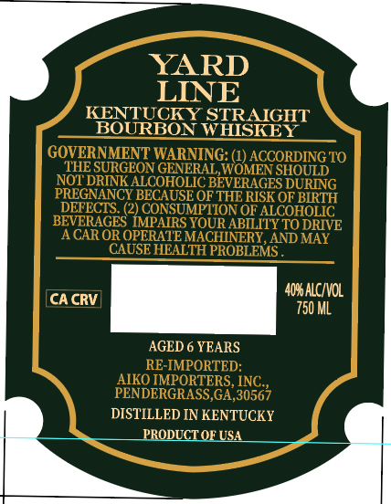
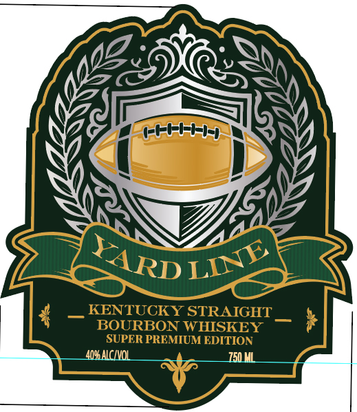

# TTB COLA Label Images - TTBID 26083001000325

**Brand Name:** YARD LINE

**Issue Date:** 03/24/2026

**Origin Code:** 00

**Product Class/Type:** 101

**Source:** [TTB Public COLA Registry](https://ttbonline.gov/colasonline/viewColaDetails.do?action=publicFormDisplay&ttbid=26083001000325)

## Label Images

### Back Label

### Front Label

## Extracted Label Text

*Text extracted via OCR - may contain errors*

**Detected Age:** 6 Years

### Back Label

YARD
LINE
KENTUCKY STRAIGHT
BOURBON WHISKEY
GOVERNMENT WARNING: (L) ACCORDING TO
THE SURGEON GENERAL WOMEN SHOULD
NOT DRINKALCOHOLIC BEVERAGES DURING
PREGNANCY BECAUSE OF THE RISK OF BIRTH
DETECTS
CONSUMPTION OF ALCOHOLIC
BEVERAGES IMPAIRS YOUR ABILITY TO DRIVE
ACAR OR OPERATE MACHINERY, AND MAY
CAUSE HEALTH PROBLEMS
40*alcivol
CA CRV
750 ML
AGED 6 YEARS
RE-IMPORTED:
AIKO IMPORTERS,INC
PENDERGRASS,GA,30567
DISTILLED IN KENTUCKY
PRODUCTOE USA

### Front Label

+Fhi-H-
KENTUCKY STRAIGHT
BOURBON WIISKEY
SUPER PREMIUM EDITION
4MaLCIVOL
150C
YARD
LINE
