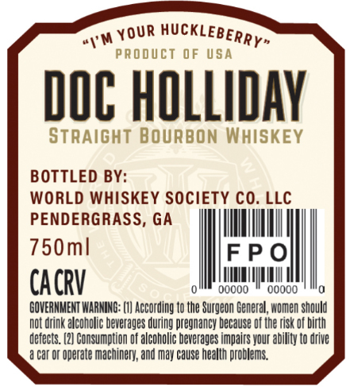
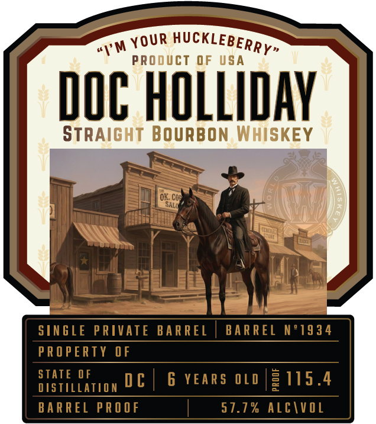

# TTB COLA Label Images - TTBID 26083001000335

**Brand Name:** DOC HOLLIDAY

**Issue Date:** 03/27/2026

**Origin Code:** 08

**Product Class/Type:** 101

**Source:** [TTB Public COLA Registry](https://ttbonline.gov/colasonline/viewColaDetails.do?action=publicFormDisplay&ttbid=26083001000335)

## Label Images

### Back Label

### Front Label

## Extracted Label Text

*Text extracted via OCR - may contain errors*

**Detected Proof:** 115.4
**Detected Age:** 6 Years

### Back Label

PROdUcT
0F USA
DOC HOLLIDAY
STRAIGHT BOURBON WHISKEY
BOTTLED BY:
WORLD WHISKEY SOCIETY CO. LLC
PENDERGRASS, GA
750ml
FP0
CACRV
0oooo
0oooo
GOVERNMENT WARNING: (V} According _
the Surgeon General; women should
not drink alcoholic beverages during pregnancy because of Uhe risk of birth
defects .
Consumption
f alcoholic beverages impairs your ability to drive
car or Operate machinery; and may cause health problems:
HUcKLEBERRY"
YouR
#"M

### Front Label

"1'M
PROdUcT
0F
USA
DOC HOLLIDAY
StRAiGHT BOURBON WHISKEY
OK: Cor
SALO
SINGLE PRIVATE
BA R REL
BARREL N'1934
PROPERTY OF
STATE OF
D €
6 YEARS 0LD
3115.4
DISTILLATION
BA R REL PRO OF
57.7 % ALCIVOL
HUcKLEBERRY"
YOUR
