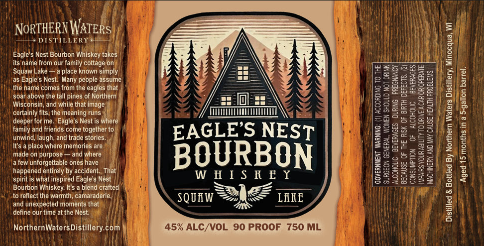

# TTB COLA Label Images - TTBID 26083001000403

**Brand Name:** EAGLE'S NEST

**Fanciful Name:** SQUAW LAKE

**Issue Date:** 03/24/2026

**Origin Code:** 48

**Product Class/Type:** 141

**Source:** [TTB Public COLA Registry](https://ttbonline.gov/colasonline/viewColaDetails.do?action=publicFormDisplay&ttbid=26083001000403)

## Label Images

### Label 1

## Extracted Label Text

*Text extracted via OCR - may contain errors*

**Detected Proof:** 90

### Label 1

NORTHERN WATERS)

* DISTILLERY #@®

Eagle's Nest Bourbon Whiskey takes
its name from our family cottage'on:
Squaw Lake —a place known simply
a Eagle’s Nest. Many people assume
thie hamé comes from the eagles that |
soar above the fall pines of Northern
Wisconsin, and while that image):
certainly fits, the meaning runs) |
deeper for me. Eagle's Nest is Where

family and friends come together tol | | E AGLE’ Ss NES

unwind, laugh, and trade stories. Ni
It's a place where memories are "|
made on purpose —and where
,ened entirely by accident. That
is what inspired Eagle's Nést WHISKEY

lery, Minocqua, WI

‘Aged 15 months in a S-gallon barrel.

ACCORDING TO THE

‘SURGEON GENERAL, WOMEN SHOULD NOT DRINK

afew unforgettable onés have
hay
spi
Bourbon Whiskey. It's a blend crafted =

to reflect the warmth, camaraderie, eae <2 tne LANE

and unexpected moments that.
define our time at the Nest:

NorthernWatersDistillery.com 45% ALC/VOL 90 PROOF 750 ML

ALCOHOLIC BEVERAGES DURING PREGNANCY
BECAUSE OF THE RISK OF BIRTH DEFECTS. (2)
CONSUMPTION OF ALCOHOLIC BEVERAGES
IMPAIRS YOUR ABILITY TO DRIVEACAR OR OPERATE.
MACHINERY, AND MAY CAUSE HEALTH PROBLEMS,

GOVERNMENT WARNING:

led & Bottled By Northern Waters Di
