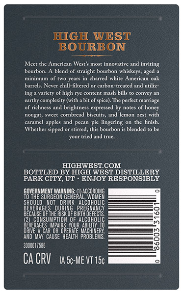
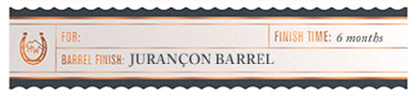

# TTB COLA Label Images - TTBID 26083001000462

**Brand Name:** HIGH WEST

**Fanciful Name:** BOURBON BARREL SELECT

**Issue Date:** 03/24/2026

**Origin Code:** 45

**Product Class/Type:** 121

**Source:** [TTB Public COLA Registry](https://ttbonline.gov/colasonline/viewColaDetails.do?action=publicFormDisplay&ttbid=26083001000462)

## Label Images

### Back Label

### Label 3

## Extracted Label Text

*Text extracted via OCR - may contain errors*

### Back Label

IGH WEST

OURBON

Meet the American West's most in

wat

e and invits

bourbon. A blend of straight bourbon whiskey

aged a

‘minim

fof two years in charred white Ameri

barrels, Never chill-filtered or carbon-treated and util

i

a variety of high 1

content mash bills to convey an

complexity (with abit of spice). The perfect marriage

of richness and brightness expressed by notes of honey

nougat, sweet cornbread biscuits, and lemon zest with

caramel apples and pecan pie lingering on the finish.

Whether sipped or st

this bourbon is blended to be

your

edand true

HIGHWEST.COM.

BOTTLED BY HIGH WEST DISTILLERY

PARK CITY, UT - ENJOY RESPONSIBLY

OVERNMENT WARNING:

ACCORDING

TO THE SURGEON GENE

SHOULO NOT DRINK ALCOHOLIC

A

L WOMEN

BEVERAGES DURING. PREGNANCY

BECAUSE OFTHE RISK OF BIRTH DEFECTS.

CONSUMPTION OF ALCOHOLIC

§

IERAGES IMPAIRS YOUR ABILITY. 10

DRIVE A CAR OR OPERATE MACHINERY,

‘AND MAY CAUSE HEALTH PROBLEMS.

‘nono

CACRV tase-Me vr 150

### Label 3

| FOR

eee

FINISH TIME: 6 months

@

| BARREL FNlS#: JURANCON BARREL
