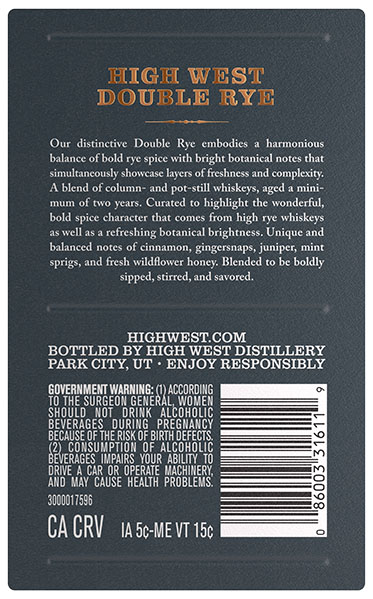
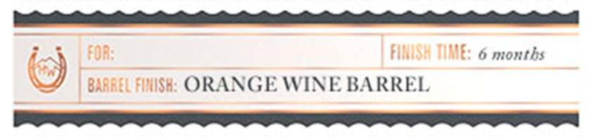

# TTB COLA Label Images - TTBID 26083001000536

**Brand Name:** HIGH WEST

**Fanciful Name:** DOUBLE RYE BARREL SELECT

**Issue Date:** 04/07/2026

**Origin Code:** 45

**Product Class/Type:** 122

**Source:** [TTB Public COLA Registry](https://ttbonline.gov/colasonline/viewColaDetails.do?action=publicFormDisplay&ttbid=26083001000536)

## Label Images

### Back Label

### Label 3

## Extracted Label Text

*Text extracted via OCR - may contain errors*

### Back Label

HIGH WEST
DOUBLE RYE
Our  distinctive Double Rye cmbodics
harmonious
Waane
bold ryc spice with bright botanical notcs that
simultancously' showcase lycrs of freshness and complexity
blend of column
and pot-still
whiskeys; aged
mini
Tam
of Io
Kcan
Curated
highlight the
bold spice character that comes from high rye
whiskeys
Wcll
refreshing botanical brightness
Unique and
balanced notes of cinnamon, gingcrsnaps
uwmuct
nin[
sprigs, and fresh wildflower honcy: Blended
boldly
sipped, stirred,and savored
HIGHWESTCOM
BOTTLED BY HIGH WEST DISTILLERY
PARK CITY, UT
ENJOY RESPONSIBLY
SOVERESURGEORE
THE
'EOIRGEGEF
0X
LCCORDLEG
shoulD
NOT
ALcorooleC
BeGeREGes
Su8hp}
UduBkoe
EZ
IDEFECTS
CONE
TIOM OF
B2V
ERAGES Impairs_YOURABILIN To
DRD
EACOROS2 OP
opeRTF probleers'
30o0017596
Ca CRV
IA 5c-ME VT 15c
onderful,

### Label 3

FOR;
fimISh ThE:
months
BAAAEU FMSH: ORANGE WINE BARREL
