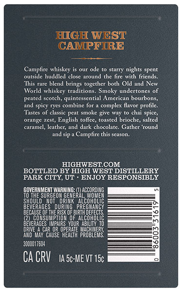
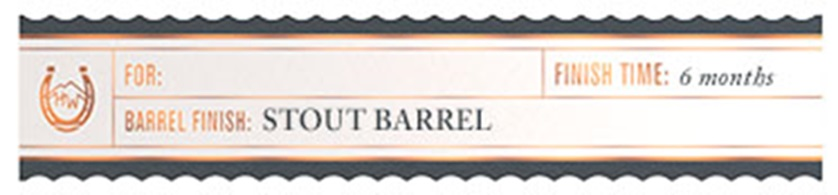

# TTB COLA Label Images - TTBID 26083001000544

**Brand Name:** HIGH WEST

**Fanciful Name:** CAMPFIRE BARREL SELECT

**Issue Date:** 04/15/2026

**Origin Code:** 45

**Product Class/Type:** 140

**Source:** [TTB Public COLA Registry](https://ttbonline.gov/colasonline/viewColaDetails.do?action=publicFormDisplay&ttbid=26083001000544)

## Label Images

### Back Label

### Label 3

## Extracted Label Text

*Text extracted via OCR - may contain errors*

### Back Label

HIGH WEST
CAMPFTRRE
Campfire whiskcy is
ode
starry nights spcnt
outside huddled
close around the fire with friends.
This nare blend
together both Old and New
World whiskey traditions. Smoky undertones of
peated scotch, quintessential American bourbons,
spicy ryes combine for
complex flavor profile:
Tastes of classic peat smoke give way
chai spice,
orange
Tet
English toffee, toasted brioche, salted
carame; lcather;
dark chocolate. Gather
Tound
and sip
Campfire this season
HIGHWESTCOM
BOTTLED BY HIGH WEST DISTILLERY
PARK CITY, UT
ENJOY RESPONSIBLY
SOVERESURGEORE
THE
'EOIRGEGEF
0X
LCCOROLEG
shoulD
ALcorooleC
BEGEREGes
Su1hp}
LduBkoe
EZ
IDEFECTS
CONE
TIOM OF
B2V
ERAGES Mmpairs_YOURABILIN_To
DRD
EACCROS OFE
operltf probleers'
CAUSE
30o0o17604
Ca CRV
IA 5c-ME VT 15c
brings

### Label 3

——————————
( ) FOR FINISH TIME: 6 months
BARREL FINISH: STOUT BARREL
ja ies
